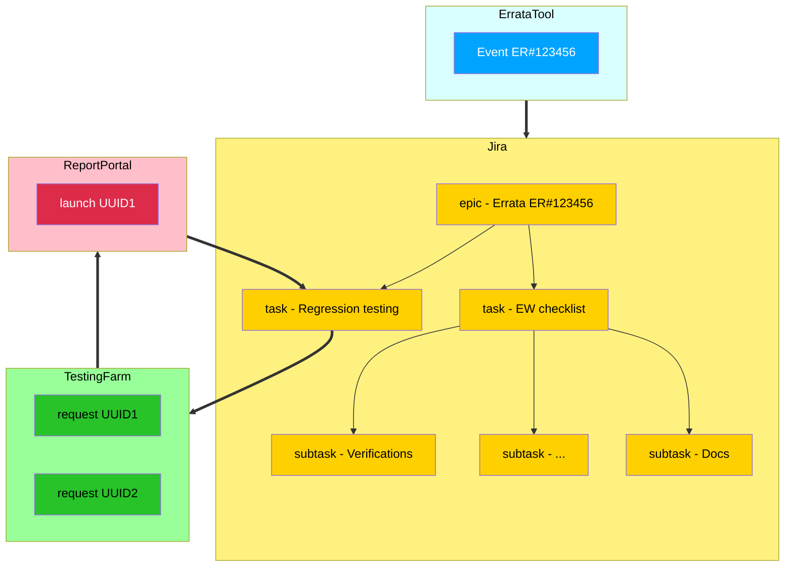

# newa

## About

The New Errata Workflow Automation (NEWA) is an attempt to replace legacy testing workflow with a new one based on the use of `tmt` (Test Management Tool), Testing Farm, Jira and ReportPortal. It ensures transparency and consistency by “standardizing” the errata testing.




## NEWA based workflow

This is the assumed workflow utilizing NEWA in short:
 1. The tester (in the future an automated job in Jenkins) runs NEWA command on erratum update.
 2. NEWA populates Jira with issues that will be used for tracking testing progress.
 3. For Jira issues associated with a recipe file NEWA will trigger Testing Farm jobs.
 4. When all TF jobs are finished NEWA updates the respective Jira issue with a link to RP launch so that a tester can review test results and eventually mark the issue as Done.


## NEWA configuration

The workflow described above requires NEWA to be properly configured by a user. In particular, a user needs to prepare:
 - NEWA configuration file providing URLs and access tokens to individual tools.
 - NEWA issue-config YAML file defining which Jira issues should be created. These issues could represent fully manual steps (like errata checklist items) or steps that are fully or partially automated through the associated recipe YAML file.
 - NEWA recipe YAML file containing necessary metadata for the test execution, for example test repository and tmt plans to be executed.  These plans are parametrized using environment variables defined by the recipe file, ensuring that all required scenarios are tested.

All these files are described in detail below.

### NEWA configuration file

By default, NEWA settings is loaded from file `$HOME/.newa`.

Below is an example of such a file.
```
[newa]
statedir_topdir=/var/tmp/newa
[erratatool]
url = https://..
enable_comments = 1
deduplicate_releases = 1
[jira]
url = https://...
token = *JIRATOKEN*
[reportportal]
url = https://...
token = *RP_TOKEN*
project = my_personal
[testingfarm]
token = *TESTING_FARM_API_TOKEN*
recheck_delay = 120
[rog]
token = *GITLAB_COM_TOKEN*
[ai]
api_url = https://...
api_token = *AI_API_TOKEN*
api_model = gemini-2.0-flash-exp
```

These settings can be overridden by environment variables that take precedence.
```
NEWA_STATEDIR_TOPDIR
NEWA_ET_URL
NEWA_ET_ENABLE_COMMENTS
NEWA_ET_DEDUPLICATE_RELEASES
NEWA_JIRA_URL
NEWA_JIRA_TOKEN
NEWA_JIRA_PROJECT
NEWA_REPORTPORTAL_URL
NEWA_REPORTPORTAL_TOKEN
NEWA_REPORTPORTAL_PROJECT
TESTING_FARM_API_TOKEN
NEWA_TF_RECHECK_DELAY
NEWA_ROG_TOKEN
NEWA_AI_API_URL
NEWA_AI_API_TOKEN
NEWA_AI_API_MODEL
NEWA_AI_SYSTEM_PROMPT
```

### Jira issue configuration file

This is a configuration for the `newa jira` subcommand and typically it targets a particular package and event, e.g. it prescribes which Jira issues should be created for an advisory.
This configuration file is passed to newa command like this:
```
newa ... jira --issue-config CONFIG_FILE ...
```
Issue config file may utilize Jinja2 templates in order to adjust configuration with event specific data.

Example of the Jira issue configuration file:
```
include: global_settings.yaml

project: MYPROJECT

board: 'My team board'

transitions:
  closed:
    - Closed
  dropped:
    - Closed.Obsolete
  processed:
    - In Progress
  passed:
    - Closed.Done

defaults:
   assignee: '{{ ERRATUM.people_assigned_to }}'
#  fields:
#    "Pool Team": "my_great_team"
#    "Story Points": 0

issues:

 - summary: "ER#{{ ERRATUM.id }} - {{ ERRATUM.summary }} (testing)"
   description: "{{ ERRATUM.url }}\n{{ ERRATUM.components|join(' ') }}"
   type: epic
   id: errata_epic
   on_respin: keep
   erratum_comment_triggers:
     - jira

 - summary: "ER#{{ ERRATUM.id }} - Sanity and regression testing {{ ERRATUM.builds|join(' ') }}"
   description: "Run all automated tests"
   type: task
   id: task_regression
   parent_id: errata_epic
   on_respin: close
   auto_transition: True
   job_recipe: https://path/to/my/NEWA/recipe/errata.yaml
   erratum_comment_triggers:
     - execute
     - report
   fields:
     Sprint: active
   links:
     "is blocked by":
       - ABC-1234
       - ABC-3456

 - summary: "ER#{{ ERRATUM.id }} - Performance testing {{ ERRATUM.builds|join(' ') }}"
   description: "Run performance benchmarks (triggered on-demand only)"
   type: task
   id: task_performance
   parent_id: errata_epic
   on_respin: close
   job_recipe: https://path/to/my/NEWA/recipe/performance.yaml
   schedule: false

 - summary: "ER#{{ ERRATUM.id }} - Security testing {{ ERRATUM.builds|join(' ') }}"
   description: "Run security tests (scheduled only for RHSA advisories)"
   type: task
   id: task_security
   parent_id: errata_epic
   on_respin: close
   job_recipe: https://path/to/my/NEWA/recipe/security.yaml
   schedule: "{{ ERRATUM.id is match('RHSA-.*') }}"
```

Individual settings are described below.

#### board and fields.Sprint

`board` is either a name (string) or a numeric ID (integer) of Jira Board that will be used to
determine the currently active and future sprints.
`Sprint` value has to be defined under `fields` settings for a particular issue item.
The possible values are 'active', 'future' or a numeric ID of a given Sprint.

See the example above.

#### environment

Defines environment variables that will be set when sheduling a recipe. Variable value may be overridden by the recipe.
Environment definition is not inherited by child Jira issues.

Example:
```
 - summary: "regression testing"
   descriptin: "task descryption"
   type: task
   environment:
     MYVAR: myvalue
   ...
```

#### context

Defines custom `tmt` context setting that will be set when scheduling a recipe. Context value may be overridden by the recipe.
Context definition is not inherited by child Jira issues.

Example:
```
 - summary: "regression testing"
   descriptin: "task descryption"
   type: task
   context:
     swtpm: yes
   ...
```

#### include

Allows user to import snippet of a file from a different URL location or a file.
If the same section exists in both files, definitions from the included file
has lower priority and the whole section is replaced completely.
The only exceptions are are `issues` and `defaults` which are merged.
To unset a value defined in an included file one can set the value to `null`.


#### iterate

Enables a user to do multiple copies of the respective action that differ in some parameters.
These parameters will be automatically added to `environment` variable definition used for a recipe.
Multiple variables can be defined for a single iteration, those will eventually override identical
variables defined in `environment` attribute.

Example:
In this example two subtasks will be created with variables `FOO` and `DESCRIPTION` being set accordingly.
```
 - summary: "regression testing - FOO={{ ENVIRONMENT.FOO }}"
   description: "{{ ENVIRONMENT.DESCRIPTION }}"
   type: subtask
   environment:
     MYVAR: thisismyvar
     DESCRIPTION: default description
   iterate:
     # this is the first iteration
     - FOO: bar
       DESCRIPTION: non-default description
     # this is the second iteration
     - FOO: baz
```

#### project and group

Defines Jira project to be used by NEWA and optionally also a user group for access restrictions.

Example:
```
project: MYPROJECT
group: "Company users"
```

#### transitions

This is a mapping which tells NEWA which particular issue states (and resolutions) it should be using. These settings depend on a particular Jira project. It is also possible to specify resolution separated by a dot, e.g. `Closed.Obsolete`.

The following transitions can be defined:

 - `closed` - Required, multiple states can be listed. Used to identify closed Jira issues.
 - `dropped` - Required, single state required. Tells NEWA which state to use when an issue is obsoleted by a newer issue.
 - `processed` - Optional, single state required. Necessary when `auto_transition` is `True`. This state is used when issue processing is finished by NEWA.
 - `passed` - Optional, single state required. Necessary when `auto_transition` is `True`. This state is used when all automated tests scheduled by NEWA pass.

Example:
```
transitions:
  closed:
    - Closed
  dropped:
    - Closed.Obsolete
  processed:
    - In Progress
# here, not using transition for passed tests
# passed:
#  - Closed.Done
```

#### defaults

Defines the default settings for individual records in the `issues` list. These settings can be overridden by a value defined in a particular issue.

Example:
```
defaults:
   assignee: '{{ ERRATUM.people_assigned_to }}'
   fields:
     "Pool Team": "my_great_team"
     "Story Points": 1
```
See `issues` section below for available options.

#### issues

Each record represents a single Jira issue that will be processed by NEWA.
The following options are available:
 - `summary`: Jira issue summary to use
 - `description`: Jira issue description to use
 - `type`: Jira issue type, could be `epic`, `task`, `sub-task`
 - `id`: unique identifier within the scope of issue-config file, it is used to identify this specific config item.
 - `parent_id`: refers to item `id` which should become a parent Jira issue of this issue.
 - `on_respin`: Defines action when the issue is obsoleted by a newer version (due to erratum respin). Possible values are `close` (i.e. create a new issue) and `keep` (i.e. reuse existing issue).
 - `auto_transition`: Defines if automatic issue state transitions are enabled (`True`) or not (`False`, a default value).
 - `schedule`: Controls whether a job should be automatically scheduled for this action (default: `True`). Can be either a boolean value or a Jinja template string that evaluates to a boolean:
   - **Boolean value**: When set to `False`, NEWA will create or update the Jira issue but will not schedule any associated job (even if `job_recipe` is defined), unless the action is explicitly selected using the `--action-id-filter` option.
   - **Jinja template**: When set to a string template (e.g., `"{{ ERRATUM.id != 'RHBA-1234' }}"`), NEWA will render the template and evaluate it to a boolean. The template has access to the same variables as other fields: `EVENT`, `ERRATUM`, `COMPOSE`, `JIRA`, `ROG`, `CONTEXT`, and `ENVIRONMENT`. The rendered string is converted to boolean where 'true', '1', or 'yes' (case-insensitive) are considered `True`, and all other values are considered `False`.
   - This is useful for creating tracking issues that don't require automated testing, for actions that should only be triggered on-demand, or for conditionally scheduling jobs based on event properties.
 - `erratum_comment_triggers` - For specified triggers, provides an update in an erratum through a comment. This functionality needs to be enabled also in the `newa` configuration file through `enable_comments = 1`. The following triggers are currently supported:
   - `jira` - Adds a comment when a Jira issue is initially 'adopted' by NEWA (either created or taken over due to `jira --map-issue` parameter).
   - `execute` - Adds a comment when automated tests are initiated by NEWA.
   - `report` - Adds a comment when automated tests results are reported by NEWA.
 - `when`: A condition that restricts when an item should be used. See "In-config tests" section for examples.
 - `fields`: A dictionary identifying additional Jira issue fields that should be set for the issue. Currently, fields Reporter, Sprint, Status, Component/s and other fields having type "number", "string", "option", "list/select" and "version" should be supported.
 - `links`: A dictionary identifying required link relations to a list of other Jira issues.

### `NEWA_COMMENT_FOOTER` environment variable

This environment variable can be used to extend a comment that NEWA adds to a Jira issue. Users can use it e.g. to append a link to a Jenkins job.

### Recipe config file

This configuration prescribes which automated jobs should be triggered in Testing Farm.
A recipe file is associated with a Jira issue through the `job_recipe` attribute in the issue config file and this Jira issue gets later updated with test results once all Testing Farm requests are completed. Recipe files may also utilize Jinja2 templates in order to adjust configuration with event specific data.

Recipe configuration file enables users to describe a complex test matrix. This is achieved by using a set of parameters passed to each Testing Farm requests and parameterized tmt plans enabling runtime adjustments.

A recipe file configuration is split into four sections. The first section is named `fixtures` and contains configuration that is relevant to all test jobs triggered by the recipe file.

The second section is named `adjustments`. It consists of a list of additional configuration adjustments that will be combined (conditionally if `when` condition is present) with a configuration from `fixtures`. Unlike `dimensions` explained below, configuration in `adjustments` do not increase the number of generated recipes, only modifies them.

The third section is named `dimensions` and it outlines how the test matrix looks like. Each dimension is identified by its name and defines a list of possible values, each value representing a configuration snippet that would be used for the respective test job. `newa` does a Cartesian product of defined dimensions, building all possible combinations. Those will be saved for further execution.

The third section is called `includes` and contains a list of other recipe files. `fixtures` definitions from those files will be included and merged with `fixtures` and `adjustments` definitions of the current recipe file. Particular settings from definitions loaded later may override settings from definitions loaded earlier. Please note that `dimensions` are not loaded from `includes`.

When merging attributes from `fixtures`, `adjustments` and `dimensions`, values from `adjustments` may override a value from `fixtures` and both may be overridden by a particular value from `dimensions`. This is on purpose so that `fixtures` may provide sane defaults that could be possibly overridden (yes, bad naming). A recipe can also override `context` or `environment` value obtained from the `jira-` YAML file (e.g. specified in issue-config file). However, a recipe can't override a value that has been defined on a command line directly using `newa --context ...`, `newa --environment ...` or `newa schedule --fixture ...` options.

Example:
Using the recipe file
```
fixtures:
    environment:
        PLANET: Earth
adjustments:
    - environment:
          STREET: Chandni Chowk
      when: ENVIRONMENT.STATE is match('India') and ENVIRONMENT.CITY is match('Delhi')
dimensions:
    states:
        - environment:
              STATE: USA
        - environment:
              STATE: India
    cities:
        - environment:
              CITY: Salem
        - environment:
              CITY: Delhi
```
`newa` will generate the following combinations:
```
PLANET=Earth, STATE=USA, CITY=Salem
PLANET=Earth, STATE=India, CITY=Salem
PLANET=Earth, STATE=USA, CITY=Delhi
PLANET=Earth, STATE=India, CITY=Delhi, STREET="Chandni Chowk"
```

Individual dimension values may also contain additional keys like `context`, `reportportal` etc. Individual options are described below.

#### environment

Defines environment varibles to use. See the example above.

#### context

Defines custom `tmt` context setting that will be passed to TestingFarm / `tmt`.

Example:
```
  context:
    swtpm: yes
```

#### how

Optional attribute. Defines if requests should be run through Testing Farm or `tmt`. The default value is `testingfarm`.
Request execution through `tmt` is not implemented, just an empty launch is created.
However, a user can see the respective `tmt` command in `execute-` YAML files in a state-dir.

#### tmt

Identifies test plans that should be executed. Possible parameters are:
 - `url`: URL of a repository with `tmt` plans.
 - `ref`: Git repo `ref` within a repository.
 - `path`: Path to `tmt` root within a repository.
 - `plan`: Identifies `tmt` test plans to execute, a regexp used to filter plans by name.
 - `plan_filter`: Specifies test plan filter. See `tmt` and Testing Farm documentation for details.
 - `cli_args`: Sets `tmt run` arguments when `how: tmt` is used. When configured by a user, `newa` will automatically append only the `plan --name ...` parameter, utilizing the above option. It is up to a user to pass all the subsequent `tmt` subcommands `discover provision prepare execute report finish` with required parameters! When `cli_args` is not set, `newa` will add all these subcommands automatically.

#### testingfarm

May define additional options passed to the `testing-farm request ...` command.
The only possible option is:
 - `cli_args`: String containing extra CLI options.

Example:
```
  testingfarm:
    cli_args: "--pipeline-type tmt-multihost"
```

#### reportportal

Contains ReportPortal launch and suite related settings. Possible parameters are:
 - `launch_name`: RP launch name to use.
 - `launch_description`: RP launch description.
 - `suite_description`: RP suite description.
 - `launch_attributes`: RP launch attributes (tags) to set for a given launch (and suite). In addition to this attributes, `tmt` contexts used for a particular `tmt` plan will be set as attributes of the respective RP suite.

Example:
```
  reportportal:
    launch_name: "keylime"
    launch_description: "keylime_server system role interoperability"
    suite_description: "Testing keylime_server role on {{ ENVIRONMENT.COMPOSE_CONTROLLER }} against keylime on {{ ENVIRONMENT.COMPOSE_KEYLIME }}"
    launch_attributes:
      tier: 1
      trigger: build
```

#### when
A condition that restricts when an item should be used. See "In-config tests" section for examples.

Example:
```
dimensions:
    versions:
      - environment:
            COMPOSE_VERIFIER: "{{ COMPOSE.id }}"
            COMPOSE_REGISTRAR: "{{ COMPOSE.id }}"
            COMPOSE_AGENT: "{{ COMPOSE.id }}"
            COMPOSE_AGENT2: RHEL-9.5.0-Nightly
        when: 'COMPOSE.id is not match("RHEL-9.5.0-Nightly")'
```

### In-config tests

Both NEWA issue-config and recipe files may contain Jinja templates that enable user to parametrize files with details obtain from the event.

A couple of examples:

```yaml
# Checking if event type equals to "errata", "compose", "RoG"
when: EVENT is erratum
when: EVENT is compose
when: EVENT is RoG
when: EVENT is jira
when: EVENT is not erratum

# Checking if errata number starts with (or contains or matches regexp) string "RHSA"
when: EVENT.id is match("f.*")
when: EVENT.id is match("b.*")

# Checking if errata release starts with (or contains or matches regexp) string "rhel-x.y"
when: ERRATUM.release is match("RHEL-.*")
when: ERRATUM.release is match("(?i)rhel-.*")
when: ERRATUM.release is match("RHEL-9.7.0")

# Negations of all checks above
when: ERRATUM.release is not match("RHEL-.*")
when: ERRATUM.erratum.release is not match("(?i)rhel-.*")
when: ERRATUM.release is not match("RHEL-9.7.0")
#
```

## Quick demo

Make sure you have your `$HOME/.newa` configuration file defined prior running this file.

```
$ REQUESTS_CA_BUNDLE=/etc/pki/tls/cert.pem newa event --compose CentOS-Stream-9 jira --issue-config demodata/jira-compose-config.yaml schedule execute report
```

Or

```
$ REQUESTS_CA_BUNDLE=/etc/pki/tls/cert.pem newa event --erratum 124115 jira --issue-config demodata/jira-errata-config.yaml schedule execute report
```

## NEWA options and subcommands

### NEWA options

#### Option `--clear`

Instructs `newa` that subcommands `event`, `jira`, `schedule`, `execute` should remove existing YAML files before proceeding. This is especially useful in combination with `-P` and `-D` options to ensure that any artifacts from a previously executed subcommand are removed and won't interfere. OTOH, do not use `--clear` option only when restarting subset of jobs as you won't be able to `report` all results later.

Example: Re-using previous state-dir and running requests only on x86_64 architecture.
```
$ newa -P --clear schedule --arch x86_64 execute report
```

#### Option `--conf-file`

Tells `newa` to use alternate config file location (default is `~/.newa`).

Example:
```
$ newa --conf-file ~/.newa.stage event --erratum=12345
```

#### Option `--debug`

Enables debug level logging.

#### Option `--help`

Prints `newa` usage help to a console.

Example:
```
$ newa --help
$ newa event --help
$ newa jira --help
```

#### Option `--state-dir`, `-D`

By default, `newa` will create a new state-dir with each invocation. This option tells `newa` which (existing) directory to use for storing and processing YAML metadata files. Typically, one would use this option to follow up on some former `newa` invocation, either for skipping or re-doing some phases.

Example:
```
$ newa event --erratum 12345
Using --state-dir=/var/tmp/newa/run-123
...
$ newa --state-dir /var/tmp/newa/run-123 jira --issue-config my-issue-config.yaml
Using --state-dir=/var/tmp/newa/run-123
...
```

#### Option `--prev-state-dir`

Similar to `--state-dir`, however no directory is specified. Instead, `newa` will use the most recent (modified) directory used by `newa` process issued from the current shell (so the functionality won't collidate with `newa` processes from different terminals).

Example:
```
$ newa event --erratum 12345
Using --state-dir=/var/tmp/newa/run-123
...
$ newa --prev-state-dir jira --issue-config my-issue-config.yaml
Using --state-dir=/var/tmp/newa/run-123
...
```

#### Option `--extract-state-dir`

Similar to `--state-dir`, however in this case the argument is URL of an archive containing NEWA YAML metadata files. For example, it could be used to follow up on a state-dir created and shared by an automation.

Example:
```
$ newa --extract-state-dir https://path/to/some/newa-run-1234.tar.gz list
```

#### Option `--context, -c`

Allows custom `tmt` context definition on a cmdline. Such a context can be used in issue-config YAML file through Jinja template through `CONTEXT.<name>`. Option can be used multiple times.
Such a CLI definition has the highest priority and the value won't be overridden in NEWA issue-config or recipe file.

Example:
```
$ newa -c foo=bar event --compose Fedora-40 ...
```

#### Option `--environment, -e`

Allows custom `tmt` environment variable definition on a cmdline. Such a variable can be used in issue-config YAML file through Jinja template through `ENVIRONMENT.<name>`. Option can be used multiple times.
Such a CLI definition has the highest priority and the value won't be overridden in NEWA issue-config or recipe file.

Example:
```
$ newa --environment FOO=bar event --compose Fedora-40 ...
```

#### Option `--force`

Enables YAML files rewrite when they already exist in state-dir.

### Subcommand `event`

This subcommand is associated with a particular event (like an erratum) and it attempts to read details about it so that this data can be utilized in later parts of the workflow. While we are using erratum as an event example, other event types could be supported in the future (e.g. compose, build, GitLab MR, Jira issue etc.).

`event` subcommands reads event details either from a command line.
```shell
newa event --erratum 12345
```
or from a files having `init-` prefix.

Produces multiple files based on the event (erratum) details,
splitting them according to the product release and populating
them with the `event` and `erratum` keys.

For example:
```shell
$ cat state/event-128049-RHEL-9.4.0.yaml
erratum:
  builds: []
  release: RHEL-9.4.0
event:
  id: '128049'
  type_: erratum

$ cat state/event-128049-RHEL-8.10.0.yaml
erratum:
  builds: []
  release: RHEL-8.10.0
event:
  id: '128049'
  type_: erratum
```

#### Option `--erratum`

Directs NEWA to the erratum-type event it should use, in particular erratum ID. Option can be used multiple times but each event will be processed individually.

Example:
```
$ newa event --erratum 12345
```

#### Option `--compose`

Directs NEWA to the compose-type event it should use, in particular a compose provided by Testing Farm. Option can be used multiple times but each event will be processed individually.

Example:
```
$ newa event --compose CentOS-Stream-10
```

#### Option `--compose-mapping`

Instructs NEWA how to map erratum release to a TF compose. Use in case the default mapping doesn't work properly. Option can be specified multiple times.

Example:
```
$ newa event --erratum 12345 --compose-mapping RHEL-9.4.0.Z.MAIN+EUS=RHEL-9.4.0-Nightly
```

#### Option `--deduplicate-releases`

Enables deduplication of erratum releases that map to the same Testing Farm compose. When multiple releases in an advisory target the same compose (e.g., RHEL-9.5.0.Z.MAIN and RHEL-9.5.0.Z.EUS both mapping to RHEL-9.5.0-Nightly), NEWA will automatically filter out redundant releases, keeping only the one with the most comprehensive architecture and build coverage.

This option is useful for reducing the number of duplicate test runs when multiple support extensions (MAIN, EUS, E4S, ELS, etc.) ship identical builds for the same compose.

The deduplication logic works as follows:
- Releases are grouped by their target Testing Farm compose
- Within each compose group, releases are compared by builds and architectures
- A release is considered redundant if another release in the same group has identical or superset builds AND identical or superset architectures
- The release with the most architectures (and most builds as a tiebreaker) is kept

This option can be set in three ways (in order of precedence):
1. Command-line flag: `--deduplicate-releases`
2. Environment variable: `NEWA_ET_DEDUPLICATE_RELEASES=1`
3. Configuration file: `deduplicate_releases = 1` in the `[erratatool]` section

Example:
```
$ newa event --erratum 12345 --deduplicate-releases jira --issue-config config.yaml schedule execute report
```

Example with configuration file:
```
[erratatool]
url = https://errata.example.com
deduplicate_releases = 1
```

#### Option `--prev-event`

Copies `event-` files from a previously used NEWA state-dir into a new (current) state-dir. See `--prev-state-dir` option above to see details how the "previous" state-dir is identified.

Example:
```
$ newa event --erratum 12345
$ newa event --prev-event jira ...
```

#### Option `--action-id-filter`

Instructs NEWA to process only a subset of issue-config actions, depending on whether the issue-config action id matches the provided regular expression.
This option has an effect across all NEWA subcommands so users can use this option to limit requests that would be cancelled, executed, reported etc.

Note: When using `--action-id-filter`, actions with `schedule: false` will have their jobs scheduled if they match the filter pattern. This allows on-demand triggering of actions that are normally not scheduled automatically.

Use with caution.

Example:
```
$ newa --action-id-filter '(epic|tier1).*' event --compose CentOS-Stream-10 jira --issue-config all-tier-config.yaml schedule execute report
```

Example (triggering performance tests that have `schedule: false`):
```
$ newa --action-id-filter 'task_performance' event --erratum 12345 jira --issue-config errata-config.yaml schedule execute report
```

#### Option `--jira-issue`

Directs NEWA to the `JIRA`-type event it should use, in particular a Jira issue key. Option can be used multiple times but each event will be processed individually. This event is not that useful for test scheduling at the moment. But you can use NEWA to create a pre-configure set of associated Jira issues.

Example:
```
$ cat demodata/jira-jira-config.yaml
issues:

 - summary: "{{ JIRA.summary }} (review)"
   description: "{{ JIRA.description }}"
   type: task
   id: tier_task
   on_respin: close
   links:
     "blocks":
       - "{{ JIRA.id }}"
   fields:
     Priority: "{{ JIRA.priority }}"

$ newa event --jira-issue ABC-12345 jira --issue-config demodata/jira-jira-config.yaml
```

#### Option `--rog-mr`

Directs NEWA to the RHELonGitLab-type event it should use, in particular a merge-request URL. Option can be used multiple times but each event will be processed individually.

Example:
```
$ newa event --rog-mr https://gitlab.com/redhat/centos-stream/rpms/bash/-/merge_requests/1
```

### Subcommand `jira`

This subcommand is responsible for interaction with Jira. It reads details previously gathered by the `event` subcommand and identifies Jira issues that should be used for tracking of individual steps of the testing process. These steps are defined in a so-called NEWA issue-config file.

Specifically, it processes multiple files having `event-` prefix. For each event/file it reads
NEWA issue-config and for each item from the configuration it
creates or updates a Jira issue and produces `jira-` file, populating it
with `jira` and `recipe` keys.

For example:
```shell
$ cat state/jira-128049-RHEL-8.10.0-NEWA-12.yaml
erratum:
  builds: []
  release: RHEL-8.10.0
event:
  id: '128049'
  type_: erratum
jira:
  id: NEWA-12
recipe:
  url: https://path/to/recipe.yaml

$ cat state/jira-128049-RHEL-9.4.0-NEWA-6.yaml
erratum:
  builds: []
  release: RHEL-9.4.0
event:
  id: '128049'
  type_: erratum
jira:
  id: NEWA-6
recipe:
  url: https://path/to/recipe.yaml
```

#### Option `--assignee`

Instructs NEWA to assign a newly created Jira issues to a particular Jira user, instead of using the value derived from the issue-config file.

Example:
```
$ newa ... jira --issue-config issue-config.yaml --assignee user@domain.com ...
```

#### Option `--unassigned`

Instructs NEWA not to assign a newly created Jira issues to a particular Jira user derived from the issue-config file.

Example:
```
$ newa ... jira --issue-config issue-config.yaml --unassigned ...
```

#### Option `--issue-config TEXT`

Instructs newa which issue-config file to use. Could be either a local file or URL. See 'Jira issue configuration file' section above for details.

#### Option `--map-issue`

Instructs NEWA to use an existing Jira issue instead of creating it according to the issue-config file. This option maps `id` identifier from the issue-config file to a Jira issue ID. NEWA will update Jira issue description with its identifier so that the next time it able to find it and there is no need to provide the mapping again. This option has to be used together with the `--issue-config` file option. It could be used multiple times.

Example:
```
$ head issue-config.yaml
issues:

 - summary: "ER#{{ ERRATUM.id }} - {{ ERRATUM.summary }} (testing)"
   description: "{{ ERRATUM.url }}\n{{ ERRATUM.components|join(' ') }}"
   type: epic
   id: errata_epic
   on_respin: keep
   erratum_comment_triggers:
     - jira
...
$ newa ... jira --issue-config issue-config.yaml --map-issue errata_epic=RHEL-12345 ...
```

#### Option `--no-newa-id`

With this option NEWA won't search for any existing Jira issues and also won't update newly created ones with special identifier in Description that would help NEWA to find the issue again in the future. Use carefully, this always leads to new issues "invisible" to NEWA in future invocations.

Example:
```
$ newa ... jira --issue-config issue-config.yaml --no-newa-id
```

#### Option `--recreate`

By default, NEWA won't create a new Jira issue if a matching one but closed is found. With this option, NEWA will created a new Jira issue instead.

Example:
```
$ newa ... jira --issue-config issue-config.yaml --recreate ...
```

#### Option `--issue`

This option works only when used together with `--job-recipe` option. It instructs NEWA which Jira issue to update with test results.

Example:
```
$ newa event --compose CentOS-Stream-9 jira --job-recipe path/to/recipe.yaml --issue RHEL-12345 schedule execute report
```

#### Option `--prev-issue`

This option works only when used together with `--job-recipe` option. Similarly to the `--issue` option, it instructs NEWA which Jira issue to update, however this time the previously used Jira issue key is automatically chosen. It works only if exactly one Jira issue key is found in the previous NEWA state-dir. See the `--prev-state-dir` option for details how the previous NEWA state-dir is identified.

Example:
```
$ newa event --compose CentOS-Stream-9 jira --issue-config testing.yaml
$ newa event --prev-event jira --prev-issue --job-recipe testing_part2.yaml
```

#### Option `--job-recipe`

This option should not be used together with the `--issue-config` option. This option tells NEWA a location of the NEWA recipe YAML file (either a local path or URL) and completely bypasses issue-config file processing step. Instead, NEWA will use the provided recipe YAML for scheduling. Could be used together with `--issue` option.

Example:
```
$ newa ... jira --job-recipe path/to/recipe.yaml --issue RHEL-12345 schedule execute report
```

### Subcommand `schedule`

This subcommand does apply only when a particular item from the Jira (issue) configuration file contains a recipe attribute which points to a specific recipe YAML file. Also, it generates all relevant combinations that will be later executed.

Specifically, it processes multiple files having `jira-` prefix. For each such file it
reads recipe details from `recipe.url` and according to that recipe
it produces multiple `request-` files, populating it with `recipe` key.

For example:
```shell
$ cat state/request-128049-RHEL-8.10.0-NEWA-12-REQ-1.yaml
erratum:
  builds: []
  release: RHEL-8.10.0
event:
  id: '128049'
  type_: erratum
jira:
  id: NEWA-12
recipe:
  url: https://path/to/recipe.yaml
request:
  context:
    distro: rhel-8.10.0
  environment: {}
  git_ref: ''
  git_url: ''
  id: REQ-1
  tmt_path: ''

$ cat state/request-128049-RHEL-8.10.0-NEWA-12-REQ-2.yaml
erratum:
  builds: []
  release: RHEL-8.10.0
event:
  id: '128049'
  type_: erratum
jira:
  id: NEWA-12
recipe:
  url: https://path/to/recipe.yaml
request:
  context:
    distro: rhel-8.10.0
  environment: {}
  git_ref: ''
  git_url: ''
  id: REQ-2
  tmt_path: ''
```

#### Option `--arch`

By default, tests are scheduled for all relevant architectures. This option can be used to limit scheduling to a particular architecture. This option can be used multiple times.

Example:
```
$ newa event --compose CentOS-Stream-9 job-recipe path/to/recipe.yaml schedule --arch x86_64 --arch aarch64 execute report
```

#### Option `--fixture`

Sets a single fixture default on a cmdline. Use with caution, hic sun leones. Can be specified multiple times.

Example: Overriding Testing Farm compose used for system provisioning.
```
$ newa --context distro=RHEL-9.6.0 event --erratum 12345 jira --job-recipe recipe.yaml schedule --fixture compose=RHEL-9.6.0-20250408.20 execute
```

Example: Changing TF CLI arguments.
```
$ newa ... schedule --fixture testingfarm.cli_args="--repository-file URL" ...
```

#### Option `--no-reportportal`

If a recipe contains `reportportal` launch configuration, NEWA will create a RP launch and instruct `tmt` to report test results to it. With `schedule --no-reportportal` option NEWA will ignore `reportportal` section from the recipe and test results won't be reported to ReportPortal. Please note that when `how: reportportal` reporting is enabled in a `tmt` plan then both `tmt` and TestinFarm request may finish with an error. Therefore, when disabling ReportPortal reporting in NEWA a user should also ensure that it is not enabled in the `tmt` plan itself. You can use `newa_report_rp` context to enable ReportPortal reporting in a `tmt` plan conditionally. Use

```
adjust:
  - when: newa_report_rp is defined
    report+:
      how: reportportal
```

Example:
```
$ newa event --compose CentOS-Stream-9 job-recipe path/to/recipe.yaml schedule --no-reportportal execute
```


### Subcommand `cancel`

Cancels TF reqests found in `execute-` files within the given state-dir.

Example:
```
$ newa --prev-state-dir cancel
```

### Subcommand `execute`

This subcommand does the actual execution. It triggers multiple Testing Farm requests in parallel (single request per one generated combination) and waits until these requests are finished and all individual test results are available in ReportPortal.

Specifically, it processes multiple files having `schedule-` prefix. For each such file it
reads request details from the inside and proceeds with the actual execution.
When tests are finished it produces files having `execute-` prefix updated with
details of the execution.

Example:
```
$ cat state/execute-RHEL-9.5.0-20240519.9-RHEL-9.5.0-20240519.9-BASEQESEC-1227-REQ-1.2.yaml
compose:
  id: RHEL-9.5.0-20240519.9
erratum: null
event:
  id: RHEL-9.5.0-20240519.9
  type_: compose
execution:
  artifacts_url: https://artifacts.somedomain.com/testing-farm/db0d98d2-f5c0-4f18-9308-66801f054342
  batch_id: 49aa0321898d
  return_code: 0
jira:
  id: BASEQESEC-1227
recipe:
  url: https://raw.githubusercontent.com/RedHatQE/newa/main/demodata/recipe1.yaml
request:
  compose: RHEL-9.5.0-20240519.9
  context:
    color: blue
  environment:
    CITY: Brno
    PLANET: Earth
  git_ref: main
  git_url: https://github.com/RedHatQE/newa.git
  id: REQ-1.2
  plan: /plan1
  rp_launch: recipe1
  tmt_path: demodata
  when: null
```

#### Option `--continue`, `-C`

This option is useful e.g. when a user wants to continue with a previously terminated `newa execute` session. It is assumed that a user will use this option together with `--state-dir` option because `newa` is going to re-use former data.

Example:

```
$ newa event --compose CentOS-Stream-9 jira --job-recipe path/to/recipe.yaml schedule execute report
Using --state-dir /var/tmp/newa/run-123
...
Ctrl+C  # during the execute step
$ newa --state-dir /var/tmp/newa/run-123 execute --continue report
```

#### Option `--no-wait`

This option instructs `newa` to not to wait for TF request finishing. It is expected that a user will eventually follow up on this `newa` session later.

Example:

```
$ newa event --compose CentOS-Stream-9 jira --job-recipe path/to/recipe.yaml schedule execute --no-wait
Using --state-dir /var/tmp/newa/run-123
...
$ newa --state-dir /var/tmp/newa/run-123 execute --continue report
```

#### Option `--restart-request`, `-R`
This option can be used to reschedule specific NEWA request, specified by the request ID (e.g. `--restart-request REQ-1.2.1`). This option can be used multiple times. Implies `--continue`.

Example:
```
newa --prev-state-dir execute -R REQ-1.2.1 -R REQ-2.2.2 report
```

#### Option `--restart-result`, `-r`
This option can be used to reschedule NEWA request that have ended with a particular result - `passed, failed, error`. For example, `--restart-result error`. Result can be either `passed`, `failed` or `error` where 'error' means that test execution hasn't been finished correctly. This option can be used multiple times. Implies `--continue`.


### Subcommand `report`

This subcommand updates RP launch with recipe status and updates the respective Jira issue with a comment and a link to RP launch containing all test results.

It processes multiple files with the `execute-` prefix,
reads RP launch details and searches for all the relevant launches, subsequently
merging them into a single launch. Later, it updates the respective Jira issue
with a note about test results availability and a link to ReportPortal launch.
This subcommand doesn't produce any files.

### Subcommand `summarize`

This subcommand generates AI-powered summaries of ReportPortal launch test results and updates the corresponding Jira issues with these summaries as comments.

It processes multiple files with the `execute-` prefix from the state directory. For each execute job that contains ReportPortal launch metadata:
1. Collects test execution data from ReportPortal including test statistics, failure categories, and Jira issue details
2. Sends the collected data to an AI model to generate a comprehensive summary
3. Updates the corresponding Jira issue with the AI-generated summary as a comment

The AI service configuration must be provided in the `newa.conf` file under the `[ai]` section or via environment variables `NEWA_AI_API_URL`, `NEWA_AI_API_TOKEN`, and `NEWA_AI_API_MODEL`.

The summarize command supports both OpenAI-compatible APIs and Google Gemini APIs. The API type is automatically detected based on the URL.

#### AI Configuration

**Configuration parameters:**
- `api_url`: API endpoint URL
- `api_token`: API authentication token or key
- `api_model`: Model name to use (default: `gemini-2.0-flash-exp`)
- `system_prompt`: Custom system prompt for AI model (optional, uses default prompt if not specified)

**Note:** The `system_prompt` parameter allows you to customize how the AI analyzes and summarizes test results. When not specified, NEWA uses a built-in prompt optimized for ReportPortal launch summaries in Jira format. You might want to customize this if you need different formatting, additional analysis criteria, or organization-specific requirements.

**Google Gemini API Configuration:**

For Gemini, you can configure the URL in two ways:

1. **Base URL approach** (recommended): Provide the base URL and let NEWA construct the full endpoint using the `api_model` setting:
```
[ai]
api_url = https://generativelanguage.googleapis.com/v1beta
api_token = YOUR_GEMINI_API_KEY
api_model = gemini-2.0-flash-exp
```

2. **Full URL approach**: Provide the complete endpoint URL (the `api_model` setting will be ignored):
```
[ai]
api_url = https://generativelanguage.googleapis.com/v1beta/models/gemini-2.0-flash-exp:generateContent
api_token = YOUR_GEMINI_API_KEY
```

**OpenAI-compatible API Configuration:**

For OpenAI and OpenAI-compatible APIs (e.g., Azure OpenAI, local LLM servers):
```
[ai]
api_url = https://api.openai.com/v1/chat/completions
api_token = sk-your-api-token-here
api_model = gpt-4o-mini
```

Or for a local LLM server:
```
[ai]
api_url = http://localhost:1234/v1/chat/completions
api_token = not-needed
api_model = local-model-name
```

**Environment Variable Configuration:**

All settings can be overridden via environment variables:
```bash
export NEWA_AI_API_URL="https://generativelanguage.googleapis.com/v1beta"
export NEWA_AI_API_TOKEN="YOUR_API_KEY"
export NEWA_AI_API_MODEL="gemini-2.0-flash-exp"
export NEWA_AI_SYSTEM_PROMPT="Your custom system prompt here..."
```

#### Usage Examples

Process previous state directory:
```
$ newa --prev-state-dir summarize
```

As part of a complete workflow:
```
$ newa event --compose CentOS-Stream-9 jira --issue-config config.yaml schedule execute report summarize
```

### Subcommand `list`

With this subcommand you get a brief listing of the most recent newa invocations.
This information is based on state-directories on the default path /var/tmp/newa.

Example:

```
$ newa list
```

## Contribute

Currently the code expects a stable Fedora release.

```shell
$ make system/fedora
$ hatch env create dev
$ hatch -e dev shell
$ newa
Usage: newa [OPTIONS] COMMAND1 [ARGS]... [COMMAND2 [ARGS]...
...
```
