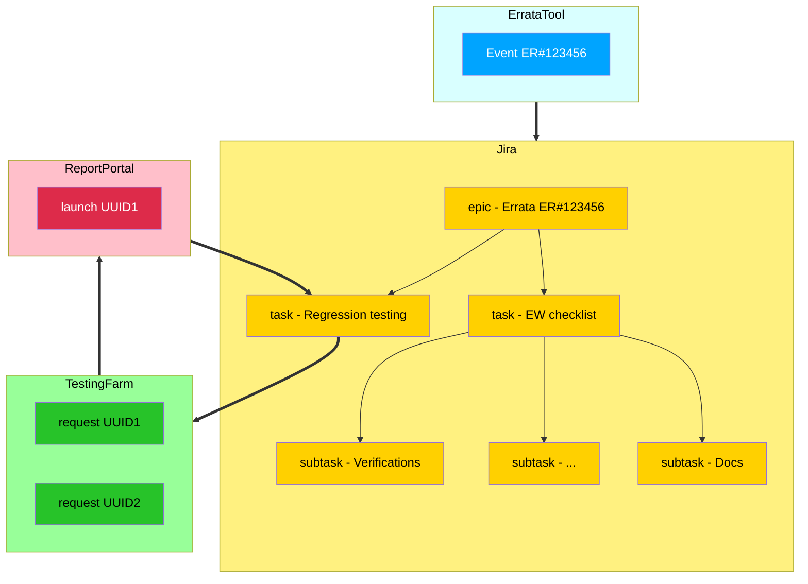

# newa

## About

The New Errata Workflow Automation (NEWA) is an attempt to replace legacy testing workflow with a new one based on the use of `tmt` (Test Management Tool), Testing Farm, Jira and ReportPortal. It ensures transparency and consistency by “standardizing” the errata testing.


```mermaid
graph TB

  subgraph ErrataTool
    Node10[Event ER#123456]
  end

  subgraph Jira
    Node20[epic - Errata ER#123456]-->Node22[task - Regression testing]
    Node20-->Node23[task - EW checklist]
    Node23-->Node24[subtask - Verifications]
    Node23-->Node25[subtask - ...]
    Node23-->Node26[subtask - Docs]
  end

  subgraph TestingFarm
    Node30[request UUID1]
    Node31[request UUID2]
  end

  subgraph ReportPortal
    Node40[launch UUID1]
  end

  ErrataTool==>Jira
  TestingFarm==>ReportPortal
  Node22==>TestingFarm
  ReportPortal==>Node22


  %% Color definitions
  classDef blue_color fill:#d9ffff,color:#000000
  classDef bluedark_color fill:#00a4ff,color:#ffffff
  classDef yellow_color fill:#fff180,color:#000000
  classDef yellowdark_color fill:#ffd000,color:#000000
  classDef green_color fill:#98ff99,color:#000000
  classDef greendark_color fill:#27c329,color:#000000
  classDef red_color fill:#ffbfca,color:#000000
  classDef reddark_color fill:#dd2b4a,color:#ffffff

  %% Colors to node mapping
  class ErrataTool blue_color;
  class Node10 bluedark_color;

  class Jira yellow_color;
  class Node20 yellowdark_color;
  class Node21 yellowdark_color;
  class Node22 yellowdark_color;
  class Node23 yellowdark_color;
  class Node24 yellowdark_color;
  class Node25 yellowdark_color;
  class Node26 yellowdark_color;

  class TestingFarm green_color;
  class Node30 greendark_color;
  class Node31 greendark_color;

  class ReportPortal red_color;
  class Node40 reddark_color;
```


## NEWA based workflow

This is the assumed workflow utilizing NEWA in short:
 1. The tester (in the future an automated job in Jenkins) runs NEWA command on erratum update.
 2. NEWA populates Jira with issues that will be used for tracking testing progress.
 3. For Jira issues associated with a recipe file NEWA will trigger Testing Farm jobs.
 4. When all TF jobs are finished NEWA updates the respective Jira issue with a link to RP launch so that a tester can review test results and eventually mark the issue as Done.


## NEWA configuration

The workflow described above requires NEWA to be properly configured by a user. In particular, a user needs to prepare:
 - NEWA configuration file providing URLs and access tokens to individual tools.
 - NEWA issue-config YAML file defining which Jira issues should be created. These issues could represent fully manual steps (like errata checklist items) or steps that are fully or partially automated through the associated recipe YAML file.
 - NEWA recipe YAML file containing necessary metadata for the test execution, for example test repository and tmt plans to be executed.  These plans are parametrized using environment variables defined by the recipe file, ensuring that all required scenarios are tested.

All these files are described in detail below.

### NEWA configuration file

By default, NEWA settings is loaded from file `$HOME/.newa`.

Below is an example of such a file.
```
[newa]
statedir_topdir=/var/tmp/newa
[erratatool]
url = https://..
enable_comments = 1
deduplicate_releases = 1
[jira]
url = https://...
token = *JIRATOKEN*
# enable_comments = 1  # (enabled by default, set to 0 to disable)
# For Jira Cloud (atlassian.net), also specify email:
# email = your-email@example.com
[reportportal]
url = https://...
token = *RP_TOKEN*
project = my_personal
[testingfarm]
token = *TESTING_FARM_API_TOKEN*
recheck_delay = 120
[rog]
token = *GITLAB_COM_TOKEN*
enable_comments = 1
[ai]
api_url = https://...
api_token = *AI_API_TOKEN*
api_model = gemini-2.0-flash-exp
```

These settings can be overridden by environment variables that take precedence.
```
NEWA_STATEDIR_TOPDIR
NEWA_ET_URL
NEWA_ET_ENABLE_COMMENTS
NEWA_ET_DEDUPLICATE_RELEASES
NEWA_JIRA_URL
NEWA_JIRA_TOKEN
NEWA_JIRA_EMAIL
NEWA_JIRA_ENABLE_COMMENTS
NEWA_JIRA_PROJECT
NEWA_REPORTPORTAL_URL
NEWA_REPORTPORTAL_TOKEN
NEWA_REPORTPORTAL_PROJECT
TESTING_FARM_API_TOKEN
NEWA_TF_RECHECK_DELAY
NEWA_ROG_TOKEN
NEWA_ROG_ENABLE_COMMENTS
NEWA_AI_API_URL
NEWA_AI_API_TOKEN
NEWA_AI_API_MODEL
NEWA_AI_SYSTEM_PROMPT
```

**Jira Server vs Jira Cloud:**

NEWA automatically detects whether you're using Jira Server or Jira Cloud based on the URL and uses API v2 for both:

- **Jira Server**: Uses Personal Access Token authentication
  ```
  [jira]
  url = https://jira.company.com
  token = YOUR_PERSONAL_ACCESS_TOKEN
  ```

- **Jira Cloud** (URLs containing `atlassian.net`): Uses email + API token authentication
  ```
  [jira]
  url = https://your-instance.atlassian.net
  email = your-email@example.com
  token = YOUR_API_TOKEN
  ```

For Jira Cloud, you need to:
1. Generate an API token at https://id.atlassian.com/manage-profile/security/api-tokens
2. Configure both `email` and `token` in the `[jira]` section

### Environment variables passed to subprocesses

For security reasons, NEWA uses a whitelist approach when passing environment variables to subprocesses (such as `testing-farm` CLI commands). This prevents sensitive credentials like `NEWA_*` configuration variables from accidentally leaking to subprocess execution environments.

Only the following environment variables from your shell environment are passed through to subprocesses:

**Required for NEWA operation:**
- `TESTING_FARM_API_TOKEN` - Required for Testing Farm CLI authentication
- `PATH` - Required to find executables
- `HOME` - May be needed by CLI tools for configuration
- `USER` - May be needed by some tools
- `LANG` - Locale settings
- `LC_ALL` - Locale settings

**Proxy and SSL certificate configuration** (for proxied environments):
- `HTTP_PROXY`, `http_proxy` - HTTP proxy server
- `HTTPS_PROXY`, `https_proxy` - HTTPS proxy server
- `NO_PROXY`, `no_proxy` - Proxy bypass list
- `REQUESTS_CA_BUNDLE` - Custom CA bundle for SSL verification
- `SSL_CERT_FILE` - SSL certificate file
- `SSL_CERT_DIR` - SSL certificate directory

**Automatically set by NEWA:**
- `NO_COLOR` - Disables colored output in subprocesses
- `NO_TTY` - Disables TTY-specific output in subprocesses

All other environment variables (including sensitive `NEWA_*` configuration variables) are filtered out and not passed to subprocesses. Additional variables may be passed through the recipe configuration (e.g., `environment` and `context` settings) as part of the test execution workflow.

### Color configuration

NEWA's `list` command supports colored output with automatic terminal detection and customizable color schemes.

#### Default behavior

Colors are automatically enabled when **any** of the following is true:
- The `FORCE_COLOR` environment variable is set (forces colors regardless of terminal), OR
- All of the following conditions are met:
  - The `NO_COLOR` environment variable is not set
  - Output is directed to a terminal (TTY)
  - The `TERM` environment variable is set to a value other than `dumb`

#### Environment variables

- `NO_COLOR` - Disables all colored output (highest priority, overrides everything)
- `FORCE_COLOR` - Forces colored output even when not in a TTY (overrides auto-detection)
- `NEWA_COLOR_CONFIG` - Path to a custom color configuration file

#### Customizing colors

To customize the color scheme, create a YAML configuration file and reference it in your NEWA configuration:

```
[newa]
color_config = /path/to/colors.yaml
```

Or use the environment variable:
```bash
export NEWA_COLOR_CONFIG=/path/to/colors.yaml
```

#### Color configuration file format

The color configuration file uses ANSI escape codes to define colors for different output elements:

```yaml
# Palette colors - for structural output elements
palette:
  state_dir: '\033[38;5;208m'      # Orange - state directory path
  event: '\033[38;5;203m'          # Light red - event lines
  issue: '\033[38;5;75m'           # Medium blue - issue lines
  request_id: '\033[32m'           # Green - request IDs (REQ-*)
  reportportal: '\033[38;5;141m'   # Purple - ReportPortal launch lines

# State colors - for request execution states
states:
  not_executed: '\033[33m'         # Yellow - not executed
  running: '\033[38;5;75m'         # Medium blue - running
  complete: '\033[32m'             # Green - complete/finished
  error: '\033[38;5;203m'          # Light red - error state
  default: '\033[38;5;208m'        # Orange - other states (cancelled, etc.)

# Result colors - for request execution results
results:
  passed: '\033[32m'               # Green - tests passed
  failed: '\033[38;5;203m'         # Light red - tests failed
  none: '\033[38;5;75m'            # Medium blue - no result yet
  cancelled: '\033[38;5;208m'      # Orange - cancelled
  default: '\033[38;5;208m'        # Orange - other results (error, skipped, etc.)
```

**Important notes:**
- If a color is not specified in the configuration file, the built-in default color will be used
- To disable color for a specific element, simply omit it from the configuration file
- All values must be valid ANSI escape codes

An example configuration file is available at `examples/colors.yaml` in the NEWA repository.

#### Common ANSI color codes

**Basic colors:**
```
Red:     '\033[31m'
Green:   '\033[32m'
Yellow:  '\033[33m'
Blue:    '\033[34m'
Magenta: '\033[35m'
Cyan:    '\033[36m'
White:   '\033[37m'
```

**256-color palette** (use `'\033[38;5;Nm'` where N is 0-255):
```
75  - Sky blue
141 - Purple/violet
203 - Light red/salmon pink
208 - Orange
226 - Bright yellow
```

**RGB colors** (use `'\033[38;2;R;G;Bm'`):
```
'\033[38;2;255;100;50m'  - Custom orange
```

### Jira issue configuration file

This is a configuration for the `newa jira` subcommand and typically it targets a particular package and event, e.g. it prescribes which Jira issues should be created for an advisory.
This configuration file is passed to newa command like this:
```
newa ... jira --issue-config CONFIG_FILE ...
```
Issue config file may utilize Jinja2 templates in order to adjust configuration with event specific data.

Example of the Jira issue configuration file:
```
include: global_settings.yaml

project: MYPROJECT

board: 'My team board'

transitions:
  closed:
    - Closed
  dropped:
    - Closed.Obsolete
  processed:
    - In Progress
  passed:
    - Closed.Done

defaults:
   assignee: '{{ ERRATUM.people_assigned_to }}'
#  fields:
#    "Pool Team": "my_great_team"
#    "Story Points": 0

issues:

 - summary: "ER#{{ ERRATUM.id }} - {{ ERRATUM.summary }} (testing)"
   description: "{{ ERRATUM.url }}\n{{ ERRATUM.components|join(' ') }}"
   type: epic
   id: errata_epic
   on_respin: keep
   erratum_comment_triggers:
     - jira

 - summary: "ER#{{ ERRATUM.id }} - Sanity and regression testing {{ ERRATUM.builds|join(' ') }}"
   description: "Run all automated tests"
   type: task
   id: task_regression
   parent_id: errata_epic
   on_respin: close
   auto_transition: True
   job_recipe: https://path/to/my/NEWA/recipe/errata.yaml
   action_tags:
     - tier1
     - regression
   erratum_comment_triggers:
     - execute
     - report
   fields:
     Sprint: active
   links:
     # Static list of issue keys
     "is blocked by":
       - ABC-1234
       - ABC-3456
     # Dynamic reference to erratum's Jira issues (fetched from Errata Tool)
     "is related to": "{{ ERRATUM.jira_issues }}"

 - summary: "ER#{{ ERRATUM.id }} - Performance testing {{ ERRATUM.builds|join(' ') }}"
   description: "Run performance benchmarks (triggered on-demand only)"
   type: task
   id: task_performance
   parent_id: errata_epic
   on_respin: close
   job_recipe: https://path/to/my/NEWA/recipe/performance.yaml
   action_tags:
     - tier2
     - performance
   schedule: false

 - summary: "ER#{{ ERRATUM.id }} - Security testing {{ ERRATUM.builds|join(' ') }}"
   description: "Run security tests (scheduled only for RHSA advisories)"
   type: task
   id: task_security
   parent_id: errata_epic
   on_respin: close
   job_recipe: https://path/to/my/NEWA/recipe/security.yaml
   action_tags:
     - tier1
     - security
   schedule: "{{ ERRATUM.id is match('RHSA-.*') }}"
```

Individual settings are described below.

#### board and fields.Sprint

`board` is either a name (string) or a numeric ID (integer) of Jira Board that will be used to
determine the currently active and future sprints.
`Sprint` value has to be defined under `fields` settings for a particular issue item.
The possible values are 'active', 'future' or a numeric ID of a given Sprint.

See the example above.

#### environment

Defines environment variables that will be set when sheduling a recipe. Variable value may be overridden by the recipe.
Environment definition is not inherited by child Jira issues.

Example:
```
 - summary: "regression testing"
   descriptin: "task descryption"
   type: task
   environment:
     MYVAR: myvalue
   ...
```

#### context

Defines custom `tmt` context setting that will be set when scheduling a recipe. Context value may be overridden by the recipe.
Context definition is not inherited by child Jira issues.

Example:
```
 - summary: "regression testing"
   descriptin: "task descryption"
   type: task
   context:
     swtpm: yes
   ...
```

#### include

Allows user to import snippet of a file from a different URL location or a file.
If the same section exists in both files, definitions from the included file
has lower priority and the whole section is replaced completely.
The only exceptions are are `issues` and `defaults` which are merged.
To unset a value defined in an included file one can set the value to `null`.

The `include` attribute supports both simple and conditional includes:

**Simple include** - Always includes the specified file:
```yaml
include:
  - global_settings.yaml
  - https://example.com/shared-config.yaml
```

**Conditional include** - Includes files based on evaluated conditions:
```yaml
include:
  # Include only when condition evaluates to true
  - url: production-settings.yaml
    when: ENVIRONMENT.DEPLOY_ENV is match('prod.*')

  # Include only for RHSA advisories
  - url: security-config.yaml
    when: ERRATUM.id is match('RHSA-.*')

  # Always include (no condition)
  - base-settings.yaml
```

The `when` condition uses the same syntax as in-config tests (see "In-config tests" section). Conditions are evaluated when the config file is loaded and have access to the following variables:

- `EVENT` - The event object (type, id)
- `ERRATUM` - Erratum data (if applicable)
- `COMPOSE` - Compose data (if applicable)
- `ROG` - RoG merge request data (if applicable)
- `CONTEXT` - Command-line context variables (from `--context`)
- `ENVIRONMENT` - Command-line environment variables (from `--environment`)

Example:

```yaml
# issue-config.yaml
include:
  # Include different defaults based on erratum type
  - url: security-team-defaults.yaml
    when: ERRATUM.id is match('RHSA-.*')
  - url: bugfix-team-defaults.yaml
    when: ERRATUM.id is match('RHBA-.*')

  # Conditional settings for different releases
  - url: rhel9-specific.yaml
    when: ERRATUM.release is match('RHEL-9.*')
  - url: rhel8-specific.yaml
    when: ERRATUM.release is match('RHEL-8.*')

  # Include based on compose
  - url: centos-stream-config.yaml
    when: COMPOSE.id is match('CentOS-Stream-.*')

  # Include based on CLI context
  - url: production-settings.yaml
    when: CONTEXT.env is match('prod.*')

project: MYPROJECT
# ... rest of config
```

This allows you to create modular, environment-specific configurations that are conditionally loaded based on the event being processed and command-line parameters.


#### iterate

Enables a user to do multiple copies of the respective action that differ in some parameters.
These parameters will be automatically added to `environment` variable definition used for a recipe.
Multiple variables can be defined for a single iteration, those will eventually override identical
variables defined in `environment` attribute.

Example:
In this example two subtasks will be created with variables `FOO` and `DESCRIPTION` being set accordingly.
```
 - summary: "regression testing - FOO={{ ENVIRONMENT.FOO }}"
   description: "{{ ENVIRONMENT.DESCRIPTION }}"
   type: subtask
   environment:
     MYVAR: thisismyvar
     DESCRIPTION: default description
   iterate:
     # this is the first iteration
     - FOO: bar
       DESCRIPTION: non-default description
     # this is the second iteration
     - FOO: baz
```

#### project and group

Defines Jira project to be used by NEWA and optionally also a user group for access restrictions.

Example:
```
project: MYPROJECT
group: "Company users"
```

#### transitions

This is a mapping which tells NEWA which particular issue states (and resolutions) it should be using. These settings depend on a particular Jira project. It is also possible to specify resolution separated by a dot, e.g. `Closed.Obsolete`.

The following transitions can be defined:

 - `closed` - Required, multiple states can be listed. Used to identify closed Jira issues.
 - `dropped` - Required, single state required. Tells NEWA which state to use when an issue is obsoleted by a newer issue.
 - `processed` - Optional, single state required. Necessary when `auto_transition` is `True`. This state is used when issue processing is finished by NEWA.
 - `passed` - Optional, single state required. Necessary when `auto_transition` is `True`. This state is used when all automated tests scheduled by NEWA pass.
 - `updated` - Optional, single state required. Used when an issue is updated for a new respin with `on_respin: update`. This state is applied after the issue is updated with the new NEWA ID, allowing you to automatically reopen closed issues or transition them to a specific status when they are updated for a new respin. This transition is applied regardless of the `auto_transition` setting.

Example:
```
transitions:
  closed:
    - Closed
  dropped:
    - Closed.Obsolete
  processed:
    - In Progress
  passed:
    - Closed.Done
  updated:
    - To Do
# here, not using transition for passed tests
# passed:
#  - Closed.Done
```

#### defaults

Defines the default settings for individual records in the `issues` list. These settings can be overridden by a value defined in a particular issue.

Example:
```
defaults:
   assignee: '{{ ERRATUM.people_assigned_to }}'
   fields:
     "Pool Team": "my_great_team"
     "Story Points": 1
```
See `issues` section below for available options.

#### issues

Each record represents a single Jira issue that will be processed by NEWA.
The following options are available:
 - `summary`: Jira issue summary to use
 - `description`: Jira issue description to use
 - `type`: Jira issue type, could be `epic`, `task`, `sub-task`
 - `id`: unique identifier within the scope of issue-config file, it is used to identify this specific config item.
 - `parent_id`: refers to item `id` which should become a parent Jira issue of this issue.
 - `action_tags`: Optional list of string tags that can be used to categorize and filter actions. These tags are stored in the generated YAML files and can be used with `--action-tag-filter` to selectively process subsets of actions. This is useful for splitting test execution into parts (e.g., by test tier, category, or priority). See example below.
 - `newa_id`: Optional custom identifier (usually a Jinja2 template) that NEWA will embed in the Jira issue description. This identifier is used by NEWA to find and reuse existing Jira issues in subsequent runs instead of creating duplicates. When NEWA processes an issue-config, it first searches for existing Jira issues containing this identifier in their description. If found, the existing issue is reused; otherwise, a new issue is created and the identifier is added to its description. This is particularly useful for erratum-based workflows where you want to track the same erratum across multiple NEWA runs. See example below.
 - `on_respin`: Defines action when the issue is obsoleted by a newer version (due to erratum respin). Possible values are:
   - `close` - Creates a new issue and marks the old one as obsolete (this is the default value)
   - `keep` - Reuses the existing open issue without updating it (only refreshes the NEWA ID)
   - `update` - Reuses the existing open issue and updates its summary, description, and custom fields. If no open issue exists but a closed issue with an old NEWA ID is found, it will be reopened and updated. When multiple old closed issues exist, the most recently updated one is selected. If the `updated` transition is configured, it will be applied after the update.
   - `inherit` - Copies the `on_respin` value from the parent issue (specified by `parent_id`). When an action is processed, if it has `on_respin: inherit`, the value is replaced with the parent's `on_respin` value. The parent must exist (via `parent_id`). If the parent doesn't explicitly set `on_respin`, the default value (`close`) will be inherited. The parent can also use `inherit`, which will be resolved first before the child inherits from it.
 - `auto_transition`: Defines if automatic issue state transitions are enabled (`True`) or not (`False`, a default value).
 - `schedule`: Controls whether a job should be automatically scheduled for this action (default: `True`). Can be either a boolean value or a Jinja template string that evaluates to a boolean:
   - **Boolean value**: When set to `False`, NEWA will create or update the Jira issue and save the recipe information, but will NOT automatically schedule the job during the `schedule` command. The job can be manually scheduled later using `schedule --schedule-all` or by using filters (`--action-id-filter` or `--issue-id-filter`).
   - **Jinja template**: When set to a string template (e.g., `"{{ ERRATUM.id is match('RHSA-.*') }}"`), NEWA will render the template and evaluate it to a boolean. The template has access to the same variables as other fields: `EVENT`, `ERRATUM`, `COMPOSE`, `JIRA`, `ROG`, `CONTEXT`, and `ENVIRONMENT`. The rendered string is converted to boolean where 'true', '1', or 'yes' (case-insensitive) are considered `True`, and all other values are considered `False`.
   - **Important**: Recipe information is ALWAYS saved to jira-* YAML files when `job_recipe` is specified, regardless of the `schedule` setting. This enables manual scheduling later without requiring access to the original issue-config file.
   - This is useful for creating tracking issues that don't require automated testing, for actions that should only be triggered on-demand, or for conditionally scheduling jobs based on event properties.
 - `erratum_comment_triggers` - For specified triggers, provides an update in an erratum through a comment. This functionality needs to be enabled also in the `newa` configuration file through `enable_comments = 1`. The following triggers are currently supported:
   - `jira` - Adds a comment when a Jira issue is initially 'adopted' by NEWA (either created or taken over due to `jira --map-issue` parameter).
   - `execute` - Adds a comment when automated tests are initiated by NEWA.
   - `report` - Adds a comment when automated test results are reported by NEWA.
 - `rog_comment_triggers` - For specified triggers, provides an update in a RoG (GitLab) merge request through a comment. This functionality needs to be enabled also in the `newa` configuration file through `[rog] enable_comments = 1`. The following triggers are currently supported:
   - `jira` - Adds a comment when a Jira issue is initially 'adopted' by NEWA (either created or taken over due to `jira --map-issue` parameter).
   - `execute` - Adds a comment when automated tests are initiated by NEWA.
   - `report` - Adds a comment when automated test results are reported by NEWA.
 - `when`: A condition that restricts when an item should be used. See "In-config tests" section for examples.
 - `fields`: A dictionary identifying additional Jira issue fields that should be set for the issue. Currently, fields Reporter, Sprint, Status, Component/s and other fields having type "number", "string", "option", "user", "list/select" and "version" should be supported. For user fields, provide email addresses which will be automatically converted to proper user identifiers (works for both Jira Server and Cloud).
 - `links`: A dictionary identifying required link relations to a list of other Jira issues. The value can be either a list of issue keys or a Jinja2 template reference to a list variable. When using a template reference (e.g., `"{{ ERRATUM.jira_issues }}"`), NEWA will evaluate the template and use the resulting list to create links. This is particularly useful for dynamically linking to all Jira issues associated with an erratum. See examples below.

#### Using custom newa_id for issue tracking (optional)

The `newa_id` attribute allows you to define a custom identifier that NEWA embeds in Jira issue descriptions. This enables NEWA to find and reuse existing issues across multiple runs instead of creating duplicates.

**Example:**
```yaml
issues:
 - summary: "Testing container ER#{{ ERRATUM.id }} {{ ERRATUM.summary }}"
   description: "{{ ERRATUM.url }}"
   assignee: '{{ ERRATUM.people_assigned_to }}'
   type: epic
   id: errata_epic
   newa_id: "ER#{{ ERRATUM.id }}"
   on_respin: keep

 - summary: "Container errata respin {{ ERRATUM.components|join(' ') }}"
   description: "testing container {{ ERRATUM.components|join(' ') }}"
   type: task
   id: errata_task
   parent_id: errata_epic
   on_respin: close
```

In this example, the epic issue uses `"ER#{{ ERRATUM.id }}"` as its NEWA ID (e.g., "ER#123456"). When you run NEWA again for the same erratum, it will find and reuse the epic issue because the identifier matches.

**Example with `on_respin: inherit`:**
```yaml
issues:
 - summary: "Testing ER#{{ ERRATUM.id }}"
   type: epic
   id: errata_epic
   on_respin: update

 - summary: "Subtask for testing"
   type: subtask
   id: subtask_1
   parent_id: errata_epic
   on_respin: inherit  # Will use 'update' from parent
```

In this example, the subtask inherits `on_respin: update` from its parent epic. This ensures consistent respin behavior without repeating the configuration.

#### Using links in issue configuration

The `links` attribute supports multiple formats for specifying Jira issue links:

**1. Static list of issue keys:**
```yaml
links:
  "is blocked by":
    - ABC-1234
    - XYZ-5678
```

**2. List with template strings:**
```yaml
links:
  "blocks":
    - "{{ JIRA.id }}"
    - "PROJECT-{{ CONTEXT.ticket_number }}"
```

**3. Template reference to a list variable (dynamic):**
```yaml
links:
  "is related to": "{{ ERRATUM.jira_issues }}"
```

In the third format, NEWA evaluates the template expression and uses the resulting list directly. This is particularly useful when you want to link to all Jira issues associated with an erratum (which are fetched from the Errata Tool API). The template must reference a variable that contains a list of Jira issue keys.

**Note:** When NEWA creates links, it automatically checks if each link already exists and if the target issue exists in Jira. Non-existent or already-linked issues are skipped with appropriate debug logging.

### `NEWA_COMMENT_FOOTER` environment variable

This environment variable can be used to extend a comment that NEWA adds to a Jira issue. Users can use it e.g. to append a link to a Jenkins job.

### Recipe config file

This configuration prescribes which automated jobs should be triggered in Testing Farm.
A recipe file is associated with a Jira issue through the `job_recipe` attribute in the issue config file and this Jira issue gets later updated with test results once all Testing Farm requests are completed. Recipe files may also utilize Jinja2 templates in order to adjust configuration with event specific data.

Recipe configuration file enables users to describe a complex test matrix. This is achieved by using a set of parameters passed to each Testing Farm requests and parameterized tmt plans enabling runtime adjustments.

A recipe file configuration is split into four sections. The first section is named `fixtures` and contains configuration that is relevant to all test jobs triggered by the recipe file.

The second section is named `adjustments`. It consists of a list of additional configuration adjustments that will be combined (conditionally if `when` condition is present) with a configuration from `fixtures`. Unlike `dimensions` explained below, configuration in `adjustments` do not increase the number of generated recipes, only modifies them.

The third section is named `dimensions` and it outlines how the test matrix looks like. Each dimension is identified by its name and defines a list of possible values, each value representing a configuration snippet that would be used for the respective test job. `newa` does a Cartesian product of defined dimensions, building all possible combinations. Those will be saved for further execution.

The third section is called `includes` and contains a list of other recipe files. `fixtures` definitions from those files will be included and merged with `fixtures` and `adjustments` definitions of the current recipe file. Particular settings from definitions loaded later may override settings from definitions loaded earlier. Please note that `dimensions` are not loaded from `includes`.

When merging attributes from `fixtures`, `adjustments` and `dimensions`, values from `adjustments` may override a value from `fixtures` and both may be overridden by a particular value from `dimensions`. This is on purpose so that `fixtures` may provide sane defaults that could be possibly overridden (yes, bad naming). A recipe can also override `context` or `environment` value obtained from the `jira-` YAML file (e.g. specified in issue-config file). However, a recipe can't override a value that has been defined on a command line directly using `newa --context ...`, `newa --environment ...` or `newa schedule --fixture ...` options.

Example:
Using the recipe file
```
fixtures:
    environment:
        PLANET: Earth
adjustments:
    - environment:
          STREET: Chandni Chowk
      when: ENVIRONMENT.STATE is match('India') and ENVIRONMENT.CITY is match('Delhi')
dimensions:
    states:
        - environment:
              STATE: USA
        - environment:
              STATE: India
    cities:
        - environment:
              CITY: Salem
        - environment:
              CITY: Delhi
```
`newa` will generate the following combinations:
```
PLANET=Earth, STATE=USA, CITY=Salem
PLANET=Earth, STATE=India, CITY=Salem
PLANET=Earth, STATE=USA, CITY=Delhi
PLANET=Earth, STATE=India, CITY=Delhi, STREET="Chandni Chowk"
```

Individual dimension values may also contain additional keys like `context`, `reportportal` etc. Individual options are described below.

#### Jinja2 Template Support in Recipes

Recipe files support Jinja2 template strings at multiple levels, allowing for dynamic recipe generation and improved reusability. Templates can be used in four ways:

1. **Template variables within field values** - Jinja2 variables used within regular YAML values (e.g., `"{{ CONTEXT.color }}"`)
2. **Individual dimension items** - A single item within a dimension list can be a Jinja2 template string
3. **Entire dimension lists** - An entire dimension list can be a Jinja2 template string that renders to a YAML list
4. **Fixtures and adjustments** - These sections can also use Jinja2 template strings

Templates can access `ENVIRONMENT` and `CONTEXT` objects that are defined in the `fixtures` section, making it possible to dynamically generate values and configuration based on the recipe context.

**Important:** There are fundamental differences in when and how these templates are rendered:

**Timing:**
- **Early rendering** (use cases 2-4): Templates that represent entire structures (dimensions, fixtures, adjustments) are rendered during YAML processing, before dimension combinations are generated.
- **Late rendering** (use case 1): Template variables within field values are rendered much later, after all dimension combinations have been generated and individual schedule YAML files are being created. This allows them to reference the specific `CONTEXT` and `ENVIRONMENT` values for each dimension combination.

**Rendering iterations:**
- **Early rendering** (use cases 2-4): Templates are rendered with a **single iteration only**. This means Jinja2 template expansion happens once, and nested template variables are not recursively expanded. This is intentional to avoid side effects during dimension generation.
- **Late rendering** (use case 1): Templates are rendered **recursively** (up to 50 iterations by default). This allows nested template variables like `{{ "{{ CONTEXT.value }}" }}` to be fully expanded through multiple rendering passes until no more changes occur or the iteration limit is reached.

**Example 1: Template variables within field values (late rendering)**

This is the most common use case. Jinja2 variables can be used directly within any string value in the recipe file. These are rendered after dimension combinations are generated, so they can reference the specific values from each combination:

```yaml
fixtures:
  environment:
    PLANET: Earth
  reportportal:
    launch_name: "my_project_tests"
    launch_description: "Testing project on {{ ENVIRONMENT.PLANET }}"
    suite_description: "tier {{ CONTEXT.tier }} tests in {{ ENVIRONMENT.CITY }}"
    launch_attributes:
      city: "{{ ENVIRONMENT.CITY }}"
      tier: "{{ CONTEXT.tier }}"

dimensions:
  cities:
    - environment:
        CITY: Brno
      context:
        tier: 1
    - environment:
        CITY: Boston
      context:
        tier: 2
```

In this example, the ReportPortal suite description will be different for each dimension combination:
- First combination: `"tier 1 tests in Brno"`
- Second combination: `"tier 2 tests in Boston"`

The template variables are rendered when schedule YAML files are created, allowing each request to have its own customized values based on its specific dimension combination.

**Example 2: Dynamic dimension list generation using ENVIRONMENT (early rendering)**

This example shows how to generate dimension items dynamically using a Jinja2 loop with an ENVIRONMENT variable defined in fixtures:

```yaml
fixtures:
    tmt:
        url: https://github.com/example/tests.git
        ref: main
        path: tests
    context:
        tier: 1
    environment:
        ARCHITECTURES: "x86_64,s390x,ppc64le,aarch64"

dimensions:
    arch: |
       
       - context:
             arch: {{ arch }}
         environment:
             ARCH_NAME: {{ arch }}
       
```

This generates 4 dimension items (one for each architecture), with both `context.arch` and `environment.ARCH_NAME` set appropriately for each.

**Example 3: Conditional dimension generation using CONTEXT (early rendering)**

This example demonstrates using templates for conditional logic based on CONTEXT values. The template is rendered during YAML processing to generate the dimension structure:

```yaml
fixtures:
    tmt:
        url: https://github.com/example/tests.git
        ref: main
    context:
        test_mode: regression
        tier: 1

dimensions:
    test_suite: |
       
       - context:
             suite: full_regression
         environment:
             TEST_ARGS: --comprehensive
       - context:
             suite: smoke
         environment:
             TEST_ARGS: --quick
       
       - context:
             suite: custom
         environment:
             TEST_ARGS: --mode={{ CONTEXT.test_mode }}
       
```

This dynamically generates different test suites based on the `test_mode` defined in the fixtures context.

**Benefits:**
- Reduce duplication in recipe files
- Generate test matrices programmatically based on environment or context variables
- Share common recipe patterns with different configurations
- Enable conditional recipe generation based on runtime settings
- Leverage existing NEWA ENVIRONMENT and CONTEXT mechanisms

#### environment

Defines environment varibles to use. See the example above.

#### context

Defines custom `tmt` context setting that will be passed to TestingFarm / `tmt`.

Example:
```
  context:
    swtpm: yes
```

#### how

Optional attribute. Defines if requests should be run through Testing Farm or `tmt`. The default value is `testingfarm`.
Request execution through `tmt` is not implemented, just an empty launch is created.
However, a user can see the respective `tmt` command in `execute-` YAML files in a state-dir.

#### tmt

Identifies test plans that should be executed. Possible parameters are:
 - `url`: URL of a repository with `tmt` plans.
 - `ref`: Git repo `ref` within a repository.
 - `path`: Path to `tmt` root within a repository.
 - `plan`: Identifies `tmt` test plans to execute, a regexp used to filter plans by name.
 - `plan_filter`: Specifies test plan filter. See `tmt` and Testing Farm documentation for details.
 - `cli_args`: Sets `tmt run` arguments when `how: tmt` is used. When configured by a user, `newa` will automatically append only the `plan --name ...` parameter, utilizing the above option. It is up to a user to pass all the subsequent `tmt` subcommands `discover provision prepare execute report finish` with required parameters! When `cli_args` is not set, `newa` will add all these subcommands automatically.

#### testingfarm

May define additional options passed to the `testing-farm request ...` command.
The only possible option is:
 - `cli_args`: String containing extra CLI options.

Example:
```
  testingfarm:
    cli_args: "--pipeline-type tmt-multihost"
```

#### reportportal

Contains ReportPortal launch and suite related settings. Possible parameters are:
 - `launch_name`: RP launch name to use.
 - `launch_description`: RP launch description.
 - `suite_description`: RP suite description.
 - `launch_attributes`: RP launch attributes (tags) to set for a given launch (and suite). In addition to this attributes, `tmt` contexts used for a particular `tmt` plan will be set as attributes of the respective RP suite.

Example:
```
  reportportal:
    launch_name: "keylime"
    launch_description: "keylime_server system role interoperability"
    suite_description: "Testing keylime_server role on {{ ENVIRONMENT.COMPOSE_CONTROLLER }} against keylime on {{ ENVIRONMENT.COMPOSE_KEYLIME }}"
    launch_attributes:
      tier: 1
      trigger: build
```

#### when
A condition that restricts when an item should be used. See "In-config tests" section for examples.

Example:
```
dimensions:
    versions:
      - environment:
            COMPOSE_VERIFIER: "{{ COMPOSE.id }}"
            COMPOSE_REGISTRAR: "{{ COMPOSE.id }}"
            COMPOSE_AGENT: "{{ COMPOSE.id }}"
            COMPOSE_AGENT2: RHEL-9.5.0-Nightly
        when: 'COMPOSE.id is not match("RHEL-9.5.0-Nightly")'
```

### In-config tests

Both NEWA issue-config and recipe files may contain Jinja templates that enable user to parametrize files with details obtain from the event.

A couple of examples:

```yaml
# Checking if event type equals to "errata", "compose", "RoG"
when: EVENT is erratum
when: EVENT is compose
when: EVENT is RoG
when: EVENT is jira
when: EVENT is not erratum

# Checking if errata number starts with (or contains or matches regexp) string "RHSA"
when: EVENT.id is match("f.*")
when: EVENT.id is match("b.*")

# Checking if errata release starts with (or contains or matches regexp) string "rhel-x.y"
when: ERRATUM.release is match("RHEL-.*")
when: ERRATUM.release is match("(?i)rhel-.*")
when: ERRATUM.release is match("RHEL-9.7.0")

# Negations of all checks above
when: ERRATUM.release is not match("RHEL-.*")
when: ERRATUM.erratum.release is not match("(?i)rhel-.*")
when: ERRATUM.release is not match("RHEL-9.7.0")
#
```

## Quick demo

Make sure you have your `$HOME/.newa` configuration file defined prior running this file.

```
$ REQUESTS_CA_BUNDLE=/etc/pki/tls/cert.pem newa event --compose CentOS-Stream-9 jira --issue-config demodata/jira-compose-config.yaml schedule execute report
```

Or

```
$ REQUESTS_CA_BUNDLE=/etc/pki/tls/cert.pem newa event --erratum 124115 jira --issue-config demodata/jira-errata-config.yaml schedule execute report
```

## NEWA options and subcommands

### Default behavior

When you run `newa` without specifying any subcommand, it defaults to the `list` subcommand with its default options. This allows for quick inspection of recent NEWA test runs without typing the full command.

Examples:
```bash
# These are equivalent - both list the last 10 state directories
$ newa
$ newa list

# These are also equivalent - both list a specific state directory
$ newa --state-dir /var/tmp/newa/run-123
$ newa --state-dir /var/tmp/newa/run-123 list

# Global options work with the default subcommand
$ newa -P
$ newa --prev-state-dir

# To use list-specific options, you must explicitly specify 'list'
$ newa list --last 20
$ newa list --all
$ newa -P list --refresh
```

This default behavior makes it convenient to check the status of your NEWA runs without having to remember the `list` subcommand each time. Note that list-specific options (like `--last`, `--all`, `--events`, `--issues`, `--refresh`) require you to explicitly specify the `list` subcommand.

### NEWA options

#### Option `--clear`

Instructs `newa` that subcommands `event`, `jira`, `schedule`, `execute` should remove existing YAML files before proceeding. This is especially useful in combination with `-P` and `-D` options to ensure that any artifacts from a previously executed subcommand are removed and won't interfere. OTOH, do not use `--clear` option only when restarting subset of jobs as you won't be able to `report` all results later.

Example: Re-using previous state-dir and running requests only on x86_64 architecture.
```
$ newa -P --clear schedule --arch x86_64 execute report
```

#### Option `--conf-file`

Tells `newa` to use alternate config file location (default is `~/.newa`).

Example:
```
$ newa --conf-file ~/.newa.stage event --erratum=12345
```

#### Option `--debug`

Enables debug level logging.

#### Option `--help`

Prints `newa` usage help to a console.

Example:
```
$ newa --help
$ newa event --help
$ newa jira --help
```

#### Option `--state-dir`, `-D`

By default, `newa` will create a new state-dir with each invocation. This option tells `newa` which (existing) directory to use for storing and processing YAML metadata files. Typically, one would use this option to follow up on some former `newa` invocation, either for skipping or re-doing some phases.

Example:
```
$ newa event --erratum 12345
Using --state-dir=/var/tmp/newa/run-123
...
$ newa --state-dir /var/tmp/newa/run-123 jira --issue-config my-issue-config.yaml
Using --state-dir=/var/tmp/newa/run-123
...
```

#### Option `--prev-state-dir`

Similar to `--state-dir`, however no directory is specified. Instead, `newa` will use the most recent (modified) directory used by `newa` process issued from the current shell (so the functionality won't collidate with `newa` processes from different terminals).

Example:
```
$ newa event --erratum 12345
Using --state-dir=/var/tmp/newa/run-123
...
$ newa --prev-state-dir jira --issue-config my-issue-config.yaml
Using --state-dir=/var/tmp/newa/run-123
...
```

#### Option `--extract-state-dir`, `-E`

Similar to `--state-dir`, however in this case the argument is the URL or file path of an archive containing NEWA YAML metadata files. For example, it could be used to follow up on a state-dir created and shared by an automation.

This option can be combined with `--action-id-filter` and `--issue-id-filter` to extract and keep only specific YAML files that match the filter criteria. When filters are specified:
- All files are first extracted from the archive
- `--action-id-filter`: Only keeps YAML files where the `jira.action_id` field matches the provided regex pattern (deletes non-matching files)
- `--issue-id-filter`: Only keeps YAML files where the `jira.id` field (Jira issue key) matches the provided regex pattern (deletes non-matching files)
- Both filters can be used together (files must match both patterns to be kept)

This option cannot be used together with `--copy-state-dir`.

Example (basic extraction without filters):
```
$ newa --extract-state-dir https://path/to/some/newa-run-1234.tar.gz list
```

Example (extract only files for specific action):
```
$ newa --extract-state-dir /path/to/archive.tar.gz --action-id-filter 'tier1_.*' schedule execute report
```

Example (extract only files for specific Jira issue):
```
$ newa --extract-state-dir https://server/newa-state.tar.gz --issue-id-filter 'RHEL-12345' schedule execute report
```

Example (extract files matching both action and issue filters):
```
$ newa --extract-state-dir /path/to/archive.tar.gz --action-id-filter 'regression_.*' --issue-id-filter 'PROJ-.*' schedule execute report
```

#### Option `--copy-state-dir`, `-C`

Copies YAML files from a state directory (identified by `--state-dir` or `--prev-state-dir`) to a newly created state directory and continues with the new state-dir. This option is useful when you want to reuse state from an existing directory (e.g., from a different machine or a shared location) without modifying the original state-dir.

This option must be used together with either `--state-dir` or `--prev-state-dir` to identify the source directory. The source directory becomes read-only, and a new state-dir is automatically created as the target.

This option can be combined with `--action-id-filter` and `--issue-id-filter` to copy only specific YAML files that match the filter criteria. When filters are specified:
- `--action-id-filter`: Only copies YAML files where the `jira.action_id` field matches the provided regex pattern
- `--issue-id-filter`: Only copies YAML files where the `jira.id` field (Jira issue key) matches the provided regex pattern
- Both filters can be used together (files must match both patterns to be copied)

This option cannot be used together with `--extract-state-dir`.

Example (basic copy without filters):
```
$ newa --state-dir /path/to/existing/run-123 --copy-state-dir list
```

Example (copying from a mounted network share):
```
$ newa --state-dir /mnt/shared/newa-state-dir/run-456 --copy-state-dir jira --issue-config config.yaml schedule execute report
```

Example (copying from previous state-dir):
```
$ newa --prev-state-dir --copy-state-dir list
```

Example (copy only files for specific action):
```
$ newa --state-dir /path/to/existing/run-123 --copy-state-dir --action-id-filter 'tier1_.*' schedule execute report
```

Example (copy only files for specific Jira issue):
```
$ newa --state-dir /path/to/existing/run-123 --copy-state-dir --issue-id-filter 'RHEL-12345' schedule execute report
```

Example (copy files matching both action and issue filters):
```
$ newa --state-dir /path/to/existing/run-123 --copy-state-dir --action-id-filter 'regression_.*' --issue-id-filter 'PROJ-.*' schedule execute report
```

#### Option `--context, -c`

Allows custom `tmt` context definition on the command line. Such a context can be used in an issue-config YAML file via a Jinja template using `CONTEXT.<name>`. Option can be used multiple times.
Such a CLI definition has the highest priority and the value won't be overridden in NEWA issue-config or recipe file.

Example:
```
$ newa -c foo=bar event --compose Fedora-40 ...
```

#### Option `--environment, -e`

Allows custom `tmt` environment variable definition on a cmdline. Such a variable can be used in issue-config YAML file through Jinja template through `ENVIRONMENT.<name>`. Option can be used multiple times.
Such a CLI definition has the highest priority and the value won't be overridden in NEWA issue-config or recipe file.

Example:
```
$ newa --environment FOO=bar event --compose Fedora-40 ...
```

#### Option `--force`

Enables YAML files rewrite when they already exist in state-dir.

#### Option `--no-comments`

Disables all comment additions to Errata Tool, RoG merge requests, and Jira issues. This option overrides all comment-related settings from both configuration files and environment variables:
- `erratatool/enable_comments` (or `NEWA_ET_ENABLE_COMMENTS`)
- `rog/enable_comments` (or `NEWA_ROG_ENABLE_COMMENTS`)
- `jira/enable_comments` (or `NEWA_JIRA_ENABLE_COMMENTS`)

This is useful when you want to run NEWA workflows without posting any comments, regardless of how the configuration is set.

Example:
```
$ newa --no-comments jira --issue-config my-config.yaml schedule execute report
```

### Subcommand `event`

This subcommand is associated with a particular event (like an erratum) and it attempts to read details about it so that this data can be utilized in later parts of the workflow. While we are using erratum as an event example, other event types could be supported in the future (e.g. compose, build, GitLab MR, Jira issue etc.).

`event` subcommands reads event details either from a command line.
```shell
newa event --erratum 12345
```
or from a files having `init-` prefix.

Produces multiple files based on the event (erratum) details,
splitting them according to the product release and populating
them with the `event` and `erratum` keys.

For example:
```shell
$ cat state/event-128049-RHEL-9.4.0.yaml
erratum:
  builds: []
  release: RHEL-9.4.0
event:
  id: '128049'
  type_: erratum

$ cat state/event-128049-RHEL-8.10.0.yaml
erratum:
  builds: []
  release: RHEL-8.10.0
event:
  id: '128049'
  type_: erratum
```

#### Option `--erratum`

Directs NEWA to the erratum-type event it should use, in particular erratum ID. Option can be used multiple times but each event will be processed individually.

Example:
```
$ newa event --erratum 12345
```

#### Option `--compose`

Directs NEWA to the compose-type event it should use, in particular a compose provided by Testing Farm. Option can be used multiple times but each event will be processed individually.

Example:
```
$ newa event --compose CentOS-Stream-10
```

#### Option `--compose-mapping`

Instructs NEWA how to map erratum release to a TF compose. Use in case the default mapping doesn't work properly. Option can be specified multiple times.

Example:
```
$ newa event --erratum 12345 --compose-mapping RHEL-9.4.0.Z.MAIN+EUS=RHEL-9.4.0-Nightly
```

#### Option `--deduplicate-releases`

Enables deduplication of erratum releases that map to the same Testing Farm compose. When multiple releases in an advisory target the same compose (e.g., RHEL-9.5.0.Z.MAIN and RHEL-9.5.0.Z.EUS both mapping to RHEL-9.5.0-Nightly), NEWA will automatically filter out redundant releases, keeping only the one with the most comprehensive architecture and build coverage.

This option is useful for reducing the number of duplicate test runs when multiple support extensions (MAIN, EUS, E4S, ELS, etc.) ship identical builds for the same compose.

The deduplication logic works as follows:
- Releases are grouped by their target Testing Farm compose
- Within each compose group, releases are compared by builds and architectures
- A release is considered redundant if another release in the same group has identical or superset builds AND identical or superset architectures
- The release with the most architectures (and most builds as a tiebreaker) is kept

This option can be set in three ways (in order of precedence):
1. Command-line flag: `--deduplicate-releases`
2. Environment variable: `NEWA_ET_DEDUPLICATE_RELEASES=1`
3. Configuration file: `deduplicate_releases = 1` in the `[erratatool]` section

Example:
```
$ newa event --erratum 12345 --deduplicate-releases jira --issue-config config.yaml schedule execute report
```

Example with configuration file:
```
[erratatool]
url = https://errata.example.com
deduplicate_releases = 1
```

#### Option `--prev-event`

Copies `event-` files from a previously used NEWA state-dir into a new (current) state-dir. See `--prev-state-dir` option above to see details how the "previous" state-dir is identified.

Example:
```
$ newa event --erratum 12345
$ newa event --prev-event jira ...
```

#### Option `--action-id-filter`

Instructs NEWA to process only a subset of issue-config actions, depending on whether the issue-config action id matches the provided regular expression.
This option has an effect across all NEWA subcommands so users can use this option to limit requests that would be cancelled, executed, reported etc.

Note: When using `--action-id-filter`, actions with `schedule: false` will have their jobs scheduled if they match the filter pattern. This allows on-demand triggering of actions that are normally not scheduled automatically.

Use with caution.

Example:
```
$ newa --action-id-filter '(epic|tier1).*' event --compose CentOS-Stream-10 jira --issue-config all-tier-config.yaml schedule execute report
```

Example (triggering performance tests that have `schedule: false`):
```
$ newa --action-id-filter 'task_performance' event --erratum 12345 jira --issue-config errata-config.yaml schedule execute report
```

#### Option `--action-tag-filter`

Instructs NEWA to process only actions whose `action_tags` match the provided filter expression. This option uses a powerful expression syntax that combines regex pattern matching with boolean operators (OR, AND, NOT), allowing you to create complex filtering rules. The filter works across all NEWA subcommands and can be used to split test execution into logical parts.

**Filter Expression Syntax:**

The filter expression supports three boolean operators:
- **`|` (OR)**: Match if **any** of the patterns match. Example: `tier1|tier2` matches actions with either "tier1" OR "tier2" tag
- **`,` (AND)**: Match if **all** of the conditions are satisfied. Example: `regression,rhel-9` matches only actions that have BOTH "regression" AND "rhel-9" tags
- **`!` (NOT)**: Exclude actions that match the pattern. Example: `!slow` excludes actions with "slow" tag

Each pattern in the expression is a **full regex pattern**, giving you the power to use wildcards and other regex features:
- `tier.*` - matches "tier1", "tier2", "tier_anything"
- `tier[12]` - matches exactly "tier1" or "tier2"
- `rhel-\d+` - matches "rhel-9", "rhel-10", etc.

**Boolean operators can be combined** to create sophisticated filters:
- `tier1|tier2` - Match actions with tier1 OR tier2
- `regression,rhel-9.*` - Match actions with regression AND rhel-9.x tags
- `!slow` - Exclude slow tests
- `tier[12]|regression,rhel-9.*,!slow` - Match (tier1 OR tier2 OR regression) AND (rhel-9.x) AND NOT (slow)

**Filter Behavior:**
- Actions are matched if their tags satisfy the entire filter expression
- Parent actions are automatically included when their child actions match (similar to `--action-id-filter`)
- Actions with `schedule: false` will have their jobs scheduled if they match the filter pattern
- This option can be combined with `--action-id-filter` and `--issue-id-filter` for fine-grained control
- Tags are stored in generated YAML files, so filtering works at all stages (jira, schedule, execute, report, list)

Use with caution.

**Examples:**

Simple OR filter (run tier1 OR tier2 tests):
```
$ newa --action-tag-filter 'tier1|tier2' event --erratum 12345 jira --issue-config config.yaml schedule execute report
```

Regex pattern (run tests matching tier followed by any character):
```
$ newa --action-tag-filter 'tier.*' event --compose CentOS-Stream-10 jira --issue-config config.yaml schedule execute report
```

AND filter (run regression tests for RHEL-9 only):
```
$ newa --action-tag-filter 'regression,rhel-9.*' --prev-state-dir schedule execute report
```

NOT filter (run all tests except slow ones):
```
$ newa --action-tag-filter '!slow' event --erratum 12345 jira --issue-config config.yaml schedule execute report
```

Complex combined filter:
```
# Run (tier1 OR tier2) AND (rhel-9.x) AND NOT (slow or nightly)
$ newa --action-tag-filter 'tier[12],rhel-9.*,!slow,!nightly' event --erratum 12345 jira --issue-config config.yaml schedule
```

Combine with other filters:
```
$ newa --action-tag-filter 'security|regression' --action-id-filter 'task_.*' event --erratum 12345 jira --issue-config config.yaml schedule
```

Use with --copy-state-dir to create a subset:
```
$ newa --state-dir /path/to/existing/run-123 --copy-state-dir --action-tag-filter 'tier1,!slow' schedule execute report
```

#### Option `--issue-id-filter`

Instructs NEWA to process only jobs associated with Jira issues whose key/ID matches the provided regular expression.
This option has an effect across all NEWA subcommands, allowing users to limit which issues are processed.

**Behavior across subcommands:**
- For **schedule, execute, report, summarize, and list** subcommands: filters existing jobs where the Jira issue ID matches the pattern
- For **jira** subcommand: only processes actions when exactly 1 existing Jira issue is found that matches the filter pattern. If no matching issue exists or multiple matching issues are found, the action is skipped. New issues are never created when using this option.

This option can be combined with `--action-id-filter` for fine-grained control over which jobs are processed. When using `--issue-id-filter` with the jira subcommand, parent-child action dependencies are relaxed to allow processing actions whose parents may have been filtered out.

Use with caution.

Example (process only a specific Jira issue):
```
$ newa --issue-id-filter 'RHEL-12345' event --erratum 123456 jira --issue-config config.yaml schedule execute report
```

Example (process issues matching a pattern):
```
$ newa --issue-id-filter 'SECENGSP-816[0-5]' --prev-state-dir schedule execute report
```

Example (combine with --action-id-filter):
```
$ newa --action-id-filter 'tier.*' --issue-id-filter 'RHEL-.*' event --compose CentOS-Stream-10 jira --issue-config config.yaml schedule
```

#### Option `--event-filter`

Instructs NEWA to process only jobs associated with events/artifacts that match the provided filter expression. The filter uses the format `object.attribute=regex` where:
- **object**: `compose`, `erratum`, or `rog`
- **attribute**: `id` (for compose/erratum/rog) or `release` (for erratum only)
- **regex**: A regular expression pattern to match against the attribute value

**Supported filters:**
- `compose.id=PATTERN` - Filter by compose ID
- `erratum.id=PATTERN` - Filter by erratum/advisory ID
- `erratum.release=PATTERN` - Filter by erratum release field
- `rog.id=PATTERN` - Filter by RoG merge request URL

**Behavior across subcommands:**
- For **event** subcommand: Only creates YAML files for events/artifacts matching the filter
- For **jira, schedule, execute, report, summarize, and list** subcommands: Only processes existing jobs where the event/artifact matches the filter

**Note:** When using `--event-filter` with the `list` command, the filter is applied to state directories in scope. By default, `newa list` only processes the last 10 state directories (unless a specific state directory is specified via `-D/--state-dir` or `-P/--prev-state-dir`). To ensure the event filter is applied across all state directories, it is recommended to use `newa list --all` when combined with `--event-filter`.

This option can be combined with `--action-id-filter` and `--issue-id-filter` for fine-grained control. It also works with `--copy-state-dir` and `--extract-state-dir` to filter which YAML files are copied or extracted.

Use with caution.

Example (filter by erratum release):
```
$ newa --event-filter 'erratum.release=RHEL-9.2.*' event --erratum 123456 jira --issue-config config.yaml schedule execute report
```

Example (combine with --copy-state-dir):
```
$ newa --state-dir /path/to/existing/run-123 --copy-state-dir --event-filter 'erratum.release=RHEL-9.2.*' schedule execute report
```

Example (combine with other filters):
```
$ newa --event-filter 'erratum.id=RHSA-.*' --action-id-filter 'tier1.*' event --erratum 123456 jira --issue-config config.yaml schedule
```

#### Option `--jira-issue`

Directs NEWA to the `JIRA`-type event it should use, in particular a Jira issue key. Option can be used multiple times but each event will be processed individually. This event is not that useful for test scheduling at the moment. But you can use NEWA to create a pre-configure set of associated Jira issues.

Example:
```
$ cat demodata/jira-jira-config.yaml
issues:

 - summary: "{{ JIRA.summary }} (review)"
   description: "{{ JIRA.description }}"
   type: task
   id: tier_task
   on_respin: close
   links:
     "blocks":
       - "{{ JIRA.id }}"
   fields:
     Priority: "{{ JIRA.priority }}"

$ newa event --jira-issue ABC-12345 jira --issue-config demodata/jira-jira-config.yaml
```

#### Option `--rog-mr`

Directs NEWA to the RHELonGitLab-type event it should use, in particular a merge-request URL. Option can be used multiple times but each event will be processed individually.

Example:
```
$ newa event --rog-mr https://gitlab.com/redhat/centos-stream/rpms/bash/-/merge_requests/1
```

### Subcommand `jira`

This subcommand is responsible for interaction with Jira. It reads details previously gathered by the `event` subcommand and identifies Jira issues that should be used for tracking of individual steps of the testing process. These steps are defined in a so-called NEWA issue-config file.

Specifically, it processes multiple files having `event-` prefix. For each event/file it reads
NEWA issue-config and for each item from the configuration it
creates or updates a Jira issue and produces `jira-` file, populating it
with `jira` and `recipe` keys.

For example:
```shell
$ cat state/jira-128049-RHEL-8.10.0-NEWA-12.yaml
erratum:
  builds: []
  release: RHEL-8.10.0
event:
  id: '128049'
  type_: erratum
jira:
  id: NEWA-12
recipe:
  url: https://path/to/recipe.yaml

$ cat state/jira-128049-RHEL-9.4.0-NEWA-6.yaml
erratum:
  builds: []
  release: RHEL-9.4.0
event:
  id: '128049'
  type_: erratum
jira:
  id: NEWA-6
recipe:
  url: https://path/to/recipe.yaml
```

#### Option `--assignee`

Instructs NEWA to assign a newly created Jira issues to a particular Jira user, instead of using the value derived from the issue-config file.

Example:
```
$ newa ... jira --issue-config issue-config.yaml --assignee user@domain.com ...
```

#### Option `--unassigned`

Instructs NEWA not to assign a newly created Jira issues to a particular Jira user derived from the issue-config file.

Example:
```
$ newa ... jira --issue-config issue-config.yaml --unassigned ...
```

#### Option `--issue-config TEXT`

Instructs newa which issue-config file to use. Could be either a local file or URL. See 'Jira issue configuration file' section above for details.

#### Option `--map-issue`

Instructs NEWA to use an existing Jira issue instead of creating it according to the issue-config file. This option maps `id` identifier from the issue-config file to a Jira issue ID. NEWA will update Jira issue description with its identifier so that the next time it able to find it and there is no need to provide the mapping again. This option has to be used together with the `--issue-config` file option. It could be used multiple times.

Example:
```
$ head issue-config.yaml
issues:

 - summary: "ER#{{ ERRATUM.id }} - {{ ERRATUM.summary }} (testing)"
   description: "{{ ERRATUM.url }}\n{{ ERRATUM.components|join(' ') }}"
   type: epic
   id: errata_epic
   on_respin: keep
   erratum_comment_triggers:
     - jira
...
$ newa ... jira --issue-config issue-config.yaml --map-issue errata_epic=RHEL-12345 ...
```

#### Option `--no-newa-id`

With this option NEWA won't search for any existing Jira issues and also won't update newly created ones with special identifier in Description that would help NEWA to find the issue again in the future. Use carefully, this always leads to new issues "invisible" to NEWA in future invocations.

Example:
```
$ newa ... jira --issue-config issue-config.yaml --no-newa-id
```

#### Option `--recreate`

By default, NEWA won't create a new Jira issue if a matching one but closed is found. With this option, NEWA will created a new Jira issue instead.

Example:
```
$ newa ... jira --issue-config issue-config.yaml --recreate ...
```

#### Option `--issue`

This option works only when used together with `--job-recipe` option. It instructs NEWA which Jira issue to update with test results. Can be specified multiple times when using multiple `--job-recipe` options to create a 1:1 mapping between recipes and issues.

Examples:
```
# Single recipe with single issue
$ newa event --compose CentOS-Stream-9 jira --job-recipe path/to/recipe.yaml --issue RHEL-12345 schedule execute report

# Multiple recipes with matching issues (1:1 mapping)
$ newa event --compose CentOS-Stream-9 jira --job-recipe recipe1.yaml --issue RHEL-123 --job-recipe recipe2.yaml --issue RHEL-456 schedule execute report
```

**Note:** When using multiple `--job-recipe` options with `--issue`, the number of `--issue` arguments must match the number of `--job-recipe` arguments, and all issue keys must be unique.

#### Option `--prev-issue`

This option works only when used together with a single `--job-recipe` option. Similarly to the `--issue` option, it instructs NEWA which Jira issue to update, however this time the previously used Jira issue key is automatically chosen. It works only if exactly one Jira issue key is found in the previous NEWA state-dir. See the `--prev-state-dir` option for details how the previous NEWA state-dir is identified.

Example:
```
$ newa event --compose CentOS-Stream-9 jira --issue-config testing.yaml
$ newa event --prev-event jira --prev-issue --job-recipe testing_part2.yaml
```

**Note:** The `--prev-issue` option cannot be used with multiple `--job-recipe` options.

#### Option `--job-recipe`

This option should not be used together with the `--issue-config` option. This option tells NEWA a location of the NEWA recipe YAML file (either a local path or URL) and completely bypasses issue-config file processing step. Instead, NEWA will use the provided recipe YAML for scheduling. Can be specified multiple times to schedule multiple recipes. Can be used together with `--issue` option.

Examples:
```
# Single recipe with issue
$ newa ... jira --job-recipe path/to/recipe.yaml --issue RHEL-12345 schedule execute report

# Multiple recipes without issues (generates unique fake Jira IDs)
$ newa ... jira --job-recipe recipe1.yaml --job-recipe recipe2.yaml --job-recipe recipe3.yaml schedule execute report

# Multiple recipes with matching issues (1:1 mapping)
$ newa ... jira --job-recipe recipe1.yaml --issue RHEL-123 --job-recipe recipe2.yaml --issue RHEL-456 schedule execute report
```

**Note:** When using multiple `--job-recipe` options:
- Without `--issue`: Each recipe gets a unique fake Jira ID (e.g., `_NO_ISSUE_1`, `_NO_ISSUE_2`, etc.)
- With `--issue`: The number of `--issue` arguments must match the number of `--job-recipe` arguments, creating a 1:1 mapping

### Subcommand `schedule`

This subcommand does apply only when a particular item from the Jira (issue) configuration file contains a recipe attribute which points to a specific recipe YAML file. Also, it generates all relevant combinations that will be later executed.

Specifically, it processes multiple files having `jira-` prefix. For each such file it
reads recipe details from `recipe.url` and according to that recipe
it produces multiple `request-` files, populating it with `recipe` key.

For example:
```shell
$ cat state/request-128049-RHEL-8.10.0-NEWA-12-REQ-1.yaml
erratum:
  builds: []
  release: RHEL-8.10.0
event:
  id: '128049'
  type_: erratum
jira:
  id: NEWA-12
recipe:
  url: https://path/to/recipe.yaml
request:
  context:
    distro: rhel-8.10.0
  environment: {}
  git_ref: ''
  git_url: ''
  id: REQ-1
  tmt_path: ''

$ cat state/request-128049-RHEL-8.10.0-NEWA-12-REQ-2.yaml
erratum:
  builds: []
  release: RHEL-8.10.0
event:
  id: '128049'
  type_: erratum
jira:
  id: NEWA-12
recipe:
  url: https://path/to/recipe.yaml
request:
  context:
    distro: rhel-8.10.0
  environment: {}
  git_ref: ''
  git_url: ''
  id: REQ-2
  tmt_path: ''
```

#### Option `--arch`

By default, tests are scheduled for all relevant architectures. This option can be used to limit scheduling to a particular architecture. This option can be used multiple times.

Example:
```
$ newa event --compose CentOS-Stream-9 job-recipe path/to/recipe.yaml schedule --arch x86_64 --arch aarch64 execute report
```

#### Option `--fixture`

Sets a single fixture default on a cmdline. Use with caution, hic sun leones. Can be specified multiple times.

Example: Overriding Testing Farm compose used for system provisioning.
```
$ newa --context distro=RHEL-9.6.0 event --erratum 12345 jira --job-recipe recipe.yaml schedule --fixture compose=RHEL-9.6.0-20250408.20 execute
```

Example: Changing TF CLI arguments.
```
$ newa ... schedule --fixture testingfarm.cli_args="--repository-file URL" ...
```

#### Option `--extra-tf-cli-args`

Appends additional arguments to the Testing Farm CLI command for all scheduled requests. This option allows you to safely extend Testing Farm arguments when `testingfarm.cli_args` is already configured in the NEWA recipe.

**Key features:**
- When the recipe already contains `testingfarm.cli_args`, the extra arguments are appended to the existing ones
- When the recipe doesn't have `testingfarm.cli_args`, the extra arguments are used as-is

**Use cases:**
- Adding temporary Testing Farm options without modifying the recipe
- Passing environment-specific arguments at runtime
- Extending recipe-defined arguments with additional options

Example: Adding a repository file to Testing Farm requests while preserving recipe args.
```
$ newa event --compose CentOS-Stream-9 jira --job-recipe recipe.yaml schedule --extra-tf-cli-args "--repository-file URL" execute report
```

Example: Adding multiple Testing Farm options.
```
$ newa ... schedule --extra-tf-cli-args "--pipeline-type tmt-multihost --debug" execute
```

**Note:** Unlike `--fixture testingfarm.cli_args="..."` which replaces the entire `testingfarm.cli_args` value from the recipe, `--extra-tf-cli-args` always appends to existing arguments, making it safer for extending recipe configurations without breaking existing functionality.

#### Option `--no-reportportal`

If a recipe contains `reportportal` launch configuration, NEWA will create a RP launch and instruct `tmt` to report test results to it. With `schedule --no-reportportal` option NEWA will ignore `reportportal` section from the recipe and test results won't be reported to ReportPortal. Please note that when `how: reportportal` reporting is enabled in a `tmt` plan then both `tmt` and TestinFarm request may finish with an error. Therefore, when disabling ReportPortal reporting in NEWA a user should also ensure that it is not enabled in the `tmt` plan itself. You can use `newa_report_rp` context to enable ReportPortal reporting in a `tmt` plan conditionally. Use

```
adjust:
  - when: newa_report_rp is defined
    report+:
      how: reportportal
```

Example:
```
$ newa event --compose CentOS-Stream-9 job-recipe path/to/recipe.yaml schedule --no-reportportal execute
```

#### Option `--rp-launch-uuid`

Allows you to reuse an existing ReportPortal launch instead of creating a new one during test execution. When this option is provided, NEWA fetches the launch metadata (name, description, URL) from ReportPortal and configures all scheduled jobs to use this existing launch.

This option is mutually exclusive with `--no-reportportal`.

The typical use case is when you want to add test results to an existing ReportPortal launch, for example:
- Running additional tests for the same erratum or compose
- Re-running tests with different configurations but keeping results in the same launch
- Consolidating results from multiple NEWA runs into a single launch

**Important notes:**
- The launch UUID must exist in the configured ReportPortal project
- NEWA will validate the launch exists before scheduling
- All generated schedule jobs will use this launch UUID
- The `execute` command will skip creating a new launch and use the provided one

Example:
```
$ newa event --compose CentOS-Stream-9 jira --job-recipe path/to/recipe.yaml schedule --rp-launch-uuid 12345678-1234-1234-1234-123456789abc execute report
```

#### Option `--schedule-all`

Forces scheduling of all jobs, including those with `schedule: false` in the issue-config. This option overrides the `auto_schedule` attribute from jira-* YAML files.

**Behavior and priority:**

The schedule subcommand follows this priority order when deciding whether to schedule a job:
1. **Filters** (`--action-id-filter`, `--issue-id-filter`) - Highest priority, always schedules matching jobs
2. **`--schedule-all` flag** - Overrides `auto_schedule` attribute from jira-* files
3. **`auto_schedule` attribute** - Default behavior based on the `schedule` attribute from issue-config

**Use cases:**
- Manually triggering performance or stress tests that are normally disabled (`schedule: false`)
- Re-running all tests after infrastructure changes
- Forcing execution of conditionally scheduled jobs regardless of their evaluation results

**Important notes:**
- When using filters (`--action-id-filter` or `--issue-id-filter`), jobs are scheduled even if `schedule: false`, making `--schedule-all` unnecessary unless you want to schedule ALL jobs
- Recipe information is always saved to jira-* YAML files during the `jira` subcommand, regardless of the `schedule` setting, enabling manual scheduling at any time

Example (schedule all jobs including those with schedule: false):
```
$ newa event --erratum 12345 --prev-state-dir schedule --schedule-all execute report
```

Example (schedule performance tests that have schedule: false):
```
$ newa event --erratum 12345 --prev-state-dir schedule --schedule-all --action-id-filter 'task_performance' execute report
```

Example (force all tests to run):
```
$ newa --prev-state-dir --clear schedule --schedule-all execute report
```


### Subcommand `cancel`

Cancels TF reqests found in `execute-` files within the given state-dir.

Example:
```
$ newa --prev-state-dir cancel
```

### Subcommand `execute`

This subcommand does the actual execution. It triggers multiple Testing Farm requests in parallel (single request per one generated combination) and waits until these requests are finished and all individual test results are available in ReportPortal.

Specifically, it processes multiple files having `schedule-` prefix. For each such file it
reads request details from the inside and proceeds with the actual execution.
When tests are finished it produces files having `execute-` prefix updated with
details of the execution.

Example:
```
$ cat state/execute-RHEL-9.5.0-20240519.9-RHEL-9.5.0-20240519.9-BASEQESEC-1227-REQ-1.2.yaml
compose:
  id: RHEL-9.5.0-20240519.9
erratum: null
event:
  id: RHEL-9.5.0-20240519.9
  type_: compose
execution:
  artifacts_url: https://artifacts.somedomain.com/testing-farm/db0d98d2-f5c0-4f18-9308-66801f054342
  batch_id: 49aa0321898d
  return_code: 0
jira:
  id: BASEQESEC-1227
recipe:
  url: https://raw.githubusercontent.com/RedHatQE/newa/main/demodata/recipe1.yaml
request:
  compose: RHEL-9.5.0-20240519.9
  context:
    color: blue
  environment:
    CITY: Brno
    PLANET: Earth
  git_ref: main
  git_url: https://github.com/RedHatQE/newa.git
  id: REQ-1.2
  plan: /plan1
  rp_launch: recipe1
  tmt_path: demodata
  when: null
```

#### Option `--continue`, `-C`

This option is useful e.g. when a user wants to continue with a previously terminated `newa execute` session. It is assumed that a user will use this option together with `--state-dir` option because `newa` is going to re-use former data.

Example:

```
$ newa event --compose CentOS-Stream-9 jira --job-recipe path/to/recipe.yaml schedule execute report
Using --state-dir /var/tmp/newa/run-123
...
Ctrl+C  # during the execute step
$ newa --state-dir /var/tmp/newa/run-123 execute --continue report
```

#### Option `--no-wait`

This option instructs `newa` to not to wait for TF request finishing. It is expected that a user will eventually follow up on this `newa` session later.

Example:

```
$ newa event --compose CentOS-Stream-9 jira --job-recipe path/to/recipe.yaml schedule execute --no-wait
Using --state-dir /var/tmp/newa/run-123
...
$ newa --state-dir /var/tmp/newa/run-123 execute --continue report
```

#### Option `--restart-request`, `-R`
This option can be used to reschedule specific NEWA request, specified by the request ID (e.g. `--restart-request REQ-1.2.1`). This option can be used multiple times. Implies `--continue`.

Example:
```
newa --prev-state-dir execute -R REQ-1.2.1 -R REQ-2.2.2 report
```

#### Option `--restart-result`, `-r`
This option can be used to reschedule NEWA requests that have ended with a particular result - `passed, failed, error`. For example, `--restart-result error`. Result can be either `passed`, `failed` or `error` where 'error' means that test execution hasn't been finished correctly. This option can be used multiple times. Implies `--continue`.

#### Option `--rp-purge`, `-X`

Removes previous test results from the ReportPortal launch before executing new Testing Farm requests. This option is particularly useful when restarting specific TF requests to avoid duplicate test results in the same ReportPortal launch.

**How it works:**
- Before initiating each Testing Farm request, NEWA identifies and removes the corresponding previous test results from ReportPortal
- Test results are identified using the `newa_batch` tag that uniquely identifies each execution run
- **Only the test results for requests being executed are removed** - other requests in the launch remain untouched
- If no matching test results are found, execution continues normally without any messages
- This operation happens per-worker, ensuring that only the requests being re-executed have their old results removed

**Use cases:**
- Restarting failed or errored test requests without accumulating duplicate results
- Re-running specific tests with updated configurations while keeping other results intact
- Maintaining clean ReportPortal launches when using `--restart-request`, `--restart-result`, or `--force`

**Important notes:**
- Only removes test results from existing ReportPortal launches (requires `launch_uuid` to be set)
- Works with `--restart-request`, `--restart-result`, and `--force` options
- If a request is not scheduled for execution, its old test results remain untouched

Example (restart failed tests and remove previous results):
```
$ newa --prev-state-dir execute --restart-result error --rp-purge report
```

Example (restart specific request and remove previous results):
```
$ newa --prev-state-dir execute --restart-request REQ-2.2.14 --rp-purge report
```

Example (force re-execution and remove previous results):
```
$ newa --force execute --rp-purge report
```


### Subcommand `report`

This subcommand updates RP launch with recipe status and updates the respective Jira issue with a comment and a link to RP launch containing all test results.

It processes multiple files with the `execute-` prefix,
reads RP launch details and searches for all the relevant launches, subsequently
merging them into a single launch. Later, it updates the respective Jira issue
with a note about test results availability and a link to ReportPortal launch.
This subcommand doesn't produce any files.

#### Option `--progress`

Reports current test execution progress without finalizing results. This option is useful for providing intermediate status updates during long-running test executions.

When `--progress` is used:
- Updates Testing Farm request statuses to get current execution state
- Adds Jira comments with "test execution is in progress" message
- Uses Testing Farm API URLs for requests not yet scheduled/finished (e.g., `https://api.dev.testing-farm.io/v0.1/requests/UUID`)
- Skips ReportPortal launch finalization and description updates
- Skips Jira issue state transitions
- Skips Errata Tool and RoG comments

Example (report progress during execution):
```
$ newa event --compose CentOS-Stream-9 jira --issue-config config.yaml schedule execute --no-wait
Using --state-dir=/var/tmp/newa/run-123
...
$ newa --state-dir=/var/tmp/newa/run-123 report --progress
# Adds progress comment to Jira without finalizing

# Later, when tests complete, finalize the results
$ newa --state-dir=/var/tmp/newa/run-123 execute --continue report
```

### Subcommand `summarize`

This subcommand generates AI-powered summaries of ReportPortal launch test results and updates the corresponding Jira issues with these summaries as comments.

It processes multiple files with the `execute-` prefix from the state directory. For each execute job that contains ReportPortal launch metadata:
1. Collects test execution data from ReportPortal including test statistics, failure categories, and Jira issue details
2. Sends the collected data to an AI model to generate a comprehensive summary
3. Updates the corresponding Jira issue with the AI-generated summary as a comment

The AI service configuration must be provided in the `newa.conf` file under the `[ai]` section or via environment variables `NEWA_AI_API_URL`, `NEWA_AI_API_TOKEN`, and `NEWA_AI_API_MODEL`.

The summarize command supports both OpenAI-compatible APIs and Google Gemini APIs. The API type is automatically detected based on the URL.

#### AI Configuration

**Configuration parameters:**
- `api_url`: API endpoint URL
- `api_token`: API authentication token or key (for API key authentication)
- `api_model`: Model name to use (default: `gemini-2.0-flash-exp`)
- `system_prompt`: Custom system prompt for AI model (optional, uses default prompt if not specified)
- `oauth2_client_secret_file`: Path to OAuth2 client secret JSON file (for OAuth2 authentication)
- `oauth2_scopes`: Comma-separated OAuth2 scopes (optional, defaults to `https://www.googleapis.com/auth/generative-language.retriever`)
- `oauth2_token_file`: Path to cached OAuth2 token file (optional, defaults to `~/.newa_oauth2_token.json`)

**Note:** The `system_prompt` parameter allows you to customize how the AI analyzes and summarizes test results. When not specified, NEWA uses a built-in prompt optimized for ReportPortal launch summaries in Jira format. You might want to customize this if you need different formatting, additional analysis criteria, or organization-specific requirements.

**Google Gemini API Configuration:**

For Gemini, you can use either **API key authentication** (simpler) or **OAuth2 authentication** (more secure).

**Option 1: API Key Authentication**

For Gemini, you can configure the URL in two ways:

1. **Base URL approach** (recommended): Provide the base URL and let NEWA construct the full endpoint using the `api_model` setting:
```
[ai]
api_url = https://generativelanguage.googleapis.com/v1beta
api_token = YOUR_GEMINI_API_KEY
api_model = gemini-2.0-flash-exp
```

2. **Full URL approach**: Provide the complete endpoint URL (the `api_model` setting will be ignored):
```
[ai]
api_url = https://generativelanguage.googleapis.com/v1beta/models/gemini-2.0-flash-exp:generateContent
api_token = YOUR_GEMINI_API_KEY
```

**Option 2: OAuth2 Authentication (Google Gemini)**

For enhanced security, you can use OAuth2 authentication instead of API keys with Google Gemini:

1. **Install OAuth2 dependencies**:
   ```bash
   pip install newa[oauth2]
   ```

2. **Create OAuth2 credentials**:
   - Go to [Google Cloud Console](https://console.cloud.google.com/)
   - Create or select a project
   - Enable the Generative Language API
   - Go to "Credentials" → "Create Credentials" → "OAuth client ID"
   - Select "Desktop app" as application type
   - Download the JSON file and save it as `~/.newa_client_secret.json`

3. **Configure NEWA**:
   ```
   [ai]
   api_url = https://generativelanguage.googleapis.com/v1beta
   api_model = gemini-2.0-flash-exp
   oauth2_client_secret_file = ~/.newa_client_secret.json
   # Optional: customize scopes (default: https://www.googleapis.com/auth/generative-language.retriever)
   # oauth2_scopes = https://www.googleapis.com/auth/generative-language.retriever
   # Optional: customize token cache location (default: ~/.newa_oauth2_token.json)
   # oauth2_token_file = ~/.newa_oauth2_token.json
   ```

4. **First run authentication**:
   On the first run of `newa summarize`, NEWA will automatically attempt to authenticate using the most appropriate method for your environment:
   - **Interactive environments** (desktop/laptop): A browser window will open for authentication
   - **Containerized/headless environments**: A local server flow will be used on port 6392 (6392 spells 'NEWA' on keypad). You'll be given a URL to open in a browser on your host machine to complete authentication.

   After authorization, credentials are cached in `~/.newa_oauth2_token.json` (or your custom location).
   Subsequent runs will use the cached credentials and automatically refresh them when needed.

   The authentication method is automatically detected - no configuration needed. If browser-based authentication fails (e.g., in a container), NEWA will automatically fall back to the local server flow.

   **For containerized environments**: Ensure port 6392 is exposed when running NEWA in a container. For example with Podman:
   ```bash
   podman run -p 6392:6392 ... your-newa-container
   ```

**Note**: If both `api_token` and `oauth2_client_secret_file` are configured, OAuth2 takes precedence for Gemini APIs.

**OpenAI-compatible API Configuration:**

For OpenAI and OpenAI-compatible APIs (e.g., Azure OpenAI, local LLM servers):
```
[ai]
api_url = https://api.openai.com/v1/chat/completions
api_token = sk-your-api-token-here
api_model = gpt-4o-mini
```

Or for a local LLM server:
```
[ai]
api_url = http://localhost:1234/v1/chat/completions
api_token = not-needed
api_model = local-model-name
```

**Environment Variable Configuration:**

All settings can be overridden via environment variables:
```bash
export NEWA_AI_API_URL="https://generativelanguage.googleapis.com/v1beta"
export NEWA_AI_API_TOKEN="YOUR_API_KEY"
export NEWA_AI_API_MODEL="gemini-2.0-flash-exp"
export NEWA_AI_SYSTEM_PROMPT="Your custom system prompt here..."
# OAuth2 specific environment variables
export NEWA_AI_OAUTH2_CLIENT_SECRET_FILE="~/.newa_client_secret.json"
export NEWA_AI_OAUTH2_SCOPES="https://www.googleapis.com/auth/generative-language.retriever"
export NEWA_AI_OAUTH2_TOKEN_FILE="~/.newa_oauth2_token.json"
```

#### Usage Examples

Process previous state directory:
```
$ newa --prev-state-dir summarize
```

As part of a complete workflow:
```
$ newa event --compose CentOS-Stream-9 jira --issue-config config.yaml schedule execute report summarize
```

### Subcommand `list`

With this subcommand you get a brief listing of newa invocations based on state directories.
This information is based on state-directories on the default path /var/tmp/newa.

By default, `list` shows details of the last 10 state directories. Use the `--all` option to list all available state directories.

#### Option `--last`

Specifies the number of most recent state directories to display (default: 10).

Example:
```
$ newa list --last 20
```

#### Option `--all`, `-a`

Lists all newa state directories instead of only the most recent ones. This option overrides `--last`.

Example:
```
$ newa list --all
$ newa list -a
```

#### Option `--events`

Lists details only up to the event level, omitting Jira issues and test execution details.

Example:
```
$ newa list --events
```

#### Option `--issues`

Lists details only up to the Jira issue level, omitting test execution details.

Example:
```
$ newa list --issues
```

#### Option `--refresh`

Refreshes Testing Farm request statuses before listing (only incomplete requests where `result == NONE`). This option requires either:
- A specific state directory via `-D/--state-dir` or `-P/--prev-state-dir`, or
- An event filter via `--event-filter` to refresh multiple matching state directories

When `--refresh` is used, NEWA will:
1. Check the current status of incomplete Testing Farm requests
2. Update the state directory with fresh data
3. Display the updated status information

Examples:
```
$ newa -D /var/tmp/newa/run-123 list --refresh
$ newa --event-filter erratum.id=167842 list --all --refresh
```

#### Option `--refresh-all`

Refreshes all Testing Farm request statuses before listing, regardless of their current status. This option overrides `--refresh` and requires either:
- A specific state directory via `-D/--state-dir` or `-P/--prev-state-dir`, or
- An event filter via `--event-filter` to refresh multiple matching state directories

Use this option when you want to force a status update for all requests, including those that have already completed.

Examples:
```
$ newa -P list --refresh-all
$ newa --event-filter erratum.id=167842 list --all --refresh-all
```

Basic usage examples:

```
# List last 10 state directories (default)
$ newa list

# List all state directories
$ newa list --all

# List all with only event-level details
$ newa list -a --events

# List specific state directory with refreshed status
$ newa -D /var/tmp/newa/run-123 list --refresh

# List previous state directory with all requests refreshed
$ newa -P list --refresh-all

# List and refresh all state directories matching an event filter
$ newa --event-filter erratum.id=167842 list --all --refresh
```

## Bash Auto-Completion

NEWA includes bash auto-completion support for all commands and options. When you install NEWA via the RPM package, bash completion is automatically installed.

### Using bash completion

After installing the RPM package, completion will be available in new shell sessions. To enable it immediately:

```bash
source /usr/share/bash-completion/completions/newa
```

### Enabling completion for aliases

If you create custom aliases for the `newa` command (e.g., `newa-stage`, `newa-prod`), you can easily enable the same bash completion for them. After sourcing the completion script, add a `complete` command for each alias in your `~/.bashrc`:

```bash
# Create your alias
alias newa-stage='newa --conf-file=/path/to/stage.conf'

# Source the completion script
source /usr/share/bash-completion/completions/newa

# Enable completion for the alias
complete -o filenames -F _newa_completion newa-stage
```

You can add this for as many aliases as you need:

```bash
alias newa-prod='newa --conf-file=/path/to/prod.conf'
complete -o filenames -F _newa_completion newa-prod
```

### Examples

```bash
# Complete subcommands
newa <TAB>
event  jira  schedule  execute  report  cancel  summarize  list

# Complete options
newa event --<TAB>
--erratum  --compose  --jira-issue  --rog-mr  --compose-mapping  ...

# Complete architectures
newa event --compose CentOS-Stream-9 jira --issue-config config.yaml schedule --arch <TAB>
x86_64  aarch64  ppc64le  s390x
```

## Claude Code Agent

NEWA includes a specialized agent definition for [Claude Code](https://claude.com/claude-code) that enables AI-assisted test orchestration and workflow management. The agent understands NEWA's command structure and can help with:

- Listing and monitoring test runs
- Starting new test execution sessions for errata, composes, and merge requests
- Checking test execution status
- Rescheduling failed or errored tests
- Finalizing test results and generating reports

### Enabling the Agent Locally

To use the NEWA agent with Claude Code:

1. **Locate the agent definition**: The agent configuration is stored in `docs/agents/claude-newa.md`

2. **Deploy to Claude Code**: Copy the agent definition to your Claude Code agents directory:
   ```bash
   mkdir -p ~/.claude/agents
   cp docs/agents/claude-newa.md ~/.claude/agents/newa.md
   ```

3. **Configure Claude Code**: Claude Code will automatically detect and load the agent from the `~/.claude/agents/` directory

### Using the Agent

Once configured, you can interact with the NEWA agent by addressing it directly with `@agent-newa` followed by your request:

- `@agent-newa list the most recent NEWA runs`
- `@agent-newa start NEWA tests for erratum RHSA-2024:12345`
- `@agent-newa what's the status of my NEWA tests?`
- `@agent-newa reschedule all failed tests from the last run`

The agent will execute appropriate NEWA commands and provide detailed status updates throughout the test execution workflow.

## Contribute

Currently the code expects a stable Fedora release.

```shell
$ make system/fedora
$ hatch env create dev
$ hatch -e dev shell
$ newa
Usage: newa [OPTIONS] COMMAND1 [ARGS]... [COMMAND2 [ARGS]...
...
```
